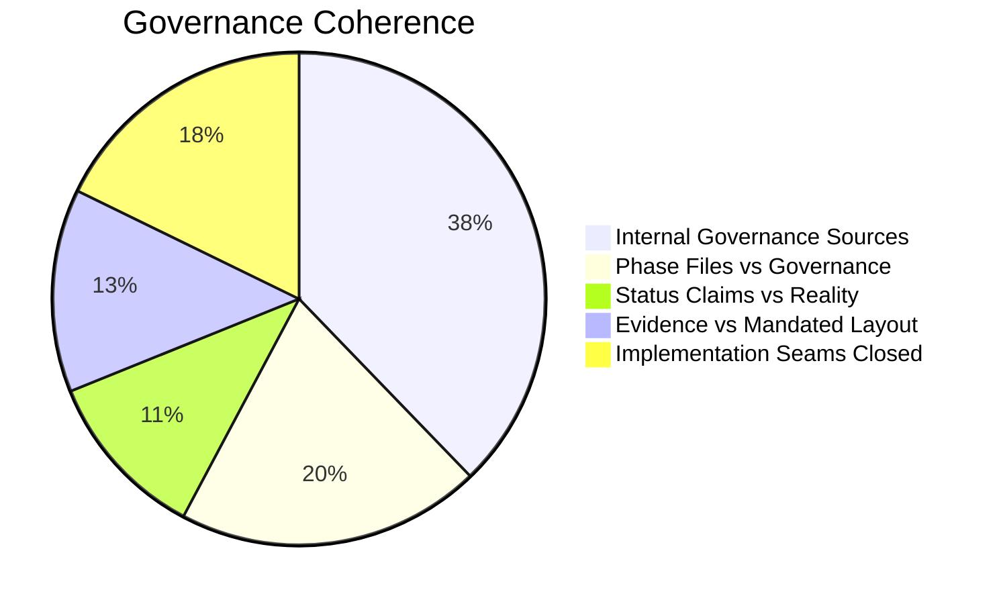
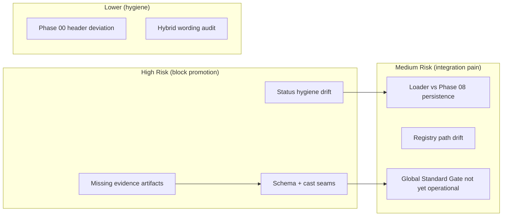

# 01 — Executive Summary

**Date:** 2026-07-04  
**Reviewer:** Critic (multi-role review: Critic / QA / UI)  
**Inputs (mandatory, fully read):**  
- `plans/2026-07-04/benchmark.md`  
- `plannnerplan/IMPLEMENTATION-DECISIONS.md`  
- `plannnerplan/QUALITY-GATES.md`  

**Context:**  
Branch `orchestrator/hotfixes-2026-07-04`. Recent staged changes to planner governance docs + addition of `blocksResolver.test.ts`. Hybrid Fabric (deploy) + Open3D (pilot) state.

---

## Overall Verdict

The three governance sources are **internally coherent** on paper:

- Clear authority hierarchy
- Precise status vocabulary
- 95%/90% coverage floors + zero-bypass
- Binding Global Standard Gate
- 5-product reference model + anti-copy rule
- Option A SVG pipeline lock

However, there is **significant drift** between these authoritative documents and the current execution artifacts (phase files, HANDOVER/FAILURESPLAN claims, code, and evidence on disk).

**Key conclusion:** The plan revision is **not yet coherent** and **not ready** for the next wave of execution phases without corrective work on status hygiene, evidence integrity, and cross-phase handoff seams.

---

## Top 5 Blocking Issues (Highest Severity)

| # | Severity | Area | Short Description | Primary Citation |
|---|----------|------|-------------------|------------------|
| 1 | bug | Status | Phase 02 claimed "Implemented + Verified-at-unit" while phase file says "Planned" and evidence is incomplete | I-D:24-29, HANDOVER:22, phases/02:4 |
| 2 | bug | Evidence | Cited `results/qa/resolver/...` paths do not exist | Q-G:47-49, testing-handbook.md |
| 3 | bug | Schema | `BlockDescriptor` has no `blocks` field; resolver + test use casts | benchmark BP-02, PLAN-FAIL-0413 |
| 4 | bug | Loader | Hardcodes `${slug}.json`; Phase 08 requires versioned + `.latest.json` | phases/08, svgBlockDescriptorLoader.ts |
| 5 | bug | Registry | Documented canonical path does not match actual file; portal alias missing | I-D:67, PLAN-FAIL-0417 |

---

## Coherence Assessment

**Dimensions that are strong:**
- Locked package set + Option A pipeline (well documented in I-D and Phase 03)
- 5-product benchmark references (Planner 5D, Floorplanner, AutoCAD, Figma, Sketchfab)
- Global Standard Framework language (I-D §113-142)
- Coverage floors + zero-bypass rules (match exactly between I-D and Q-G)

**Dimensions that are weak:**
- Status vocabulary discipline
- Evidence artifact preservation and citation
- Schema / resolver / loader / persistence contract alignment
- Explicit Global Standard Gate checklist items in affected phases
- Portal + descriptor-driven inventory scaffolding

---

## Risk Heatmap

---

## Recommendations (Prioritized)

1. **Immediate (before any further Implemented claims)**
   - Correct all premature "Implemented / Verified-at-unit" language in HANDOVER + FAILURESPLAN.
   - Fix evidence citations to real locations under `results/`.
   - Extend `BlockDescriptorCommonBaseSchema` with `blocks` and remove casts from resolver.

2. **Short term (Phase 02/03/04 readiness)**
   - Align `svgBlockDescriptorLoader` to pointer + versioned files.
   - Add explicit `## UI Global Standards Gate` + `## Global Standard Gate` checklist sections to Phases 04/05/06/10.
   - Normalize Phase 00 header to match 01-10.

3. **Medium term**
   - Produce fresh dated benchmark + independent GS review artifacts.
   - Scaffold missing admin + portal routes.
   - Exercise anti-copy visual review against generated assets.

---

## Files in This Critique Package

See sibling Markdown files for deep dives with diagrams.

**End of Executive Summary.**
