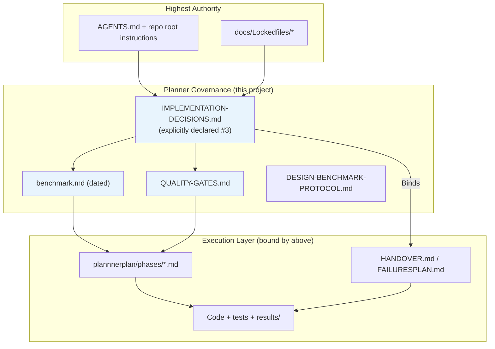
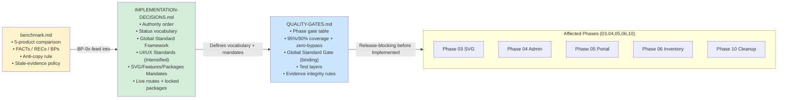

# 02 — Governance Relationships

**Date:** 2026-07-04  
**Inputs:** `plans/2026-07-04/benchmark.md`, `plannnerplan/IMPLEMENTATION-DECISIONS.md`, `plannnerplan/QUALITY-GATES.md`

---

## Authority Hierarchy (as declared)

**Key rule from IMPLEMENTATION-DECISIONS.md:3-4**
> "This file (`IMPLEMENTATION-DECISIONS.md`) is the planner project's source-of-truth. Phase files bind to this file; conflicts go here."

---

## The Three Mandatory Documents — Relationship Diagram

---

## Document Interaction Matrix

| Concern                        | benchmark.md                  | IMPLEMENTATION-DECISIONS.md      | QUALITY-GATES.md              | Winner / Binding Rule |
|--------------------------------|-------------------------------|----------------------------------|-------------------------------|-----------------------|
| Status vocabulary              | References                    | Defines exactly (Planned → Accepted) | Enforces via exit rules      | I-D (primary)        |
| Coverage floors                | Cross-refs                    | 95% target / 90% hard            | Same numbers + zero-bypass   | Match (both)         |
| Global Standard Gate           | Provides dated report + BPs   | Declares binding + "must add checklist" | Makes it release-blocking    | All three            |
| Anti-copy rule                 | §6 + 5-product details        | "only semantic tokens"           | Visual regression + gate     | benchmark primary    |
| Evidence format                | "stale-evidence policy"       | Results/ per handbook            | `results/<module>/<phase>/...` + run.json/raw.log | Q-G + handbook      |
| Schema / contract anchoring    | BP-02                         | Module paths + single source     | Contract tests               | I-D + benchmark BP   |

---

## What "Binds" Means in Practice

From the documents:

1. A phase may only move from `Planned` → `Implemented` after the relevant gates in Q-G are satisfied.
2. Global Standard Gate (I-D + Q-G) requires:
   - Fresh dated benchmark
   - Independent UI review sign-off
   - Anti-copy + pattern attestation in Decision Log
3. Phase files are **not** independent documents — they are checklists that must reference the above.

Current observed state (2026-07-04):
- Many phases still correctly say `Status: Planned`.
- HANDOVER and FAILURESPLAN have begun claiming "Implemented" for Phase 02 without satisfying the gates above.
- This is the core coherence failure surfaced by the Critic role.

---

## Recommended Reading Order (for future agents)

1. `IMPLEMENTATION-DECISIONS.md` (authority + vocabulary + mandates)
2. `plans/2026-07-04/benchmark.md` (concrete FACTs + BPs + 5-product model)
3. `plannnerplan/QUALITY-GATES.md` (what must be proven before promotion)
4. Individual phase files (only as checklists against the above)

---

**Next:** See `03-status-vocabulary-drift.md` for the most visible symptom of the current drift.
