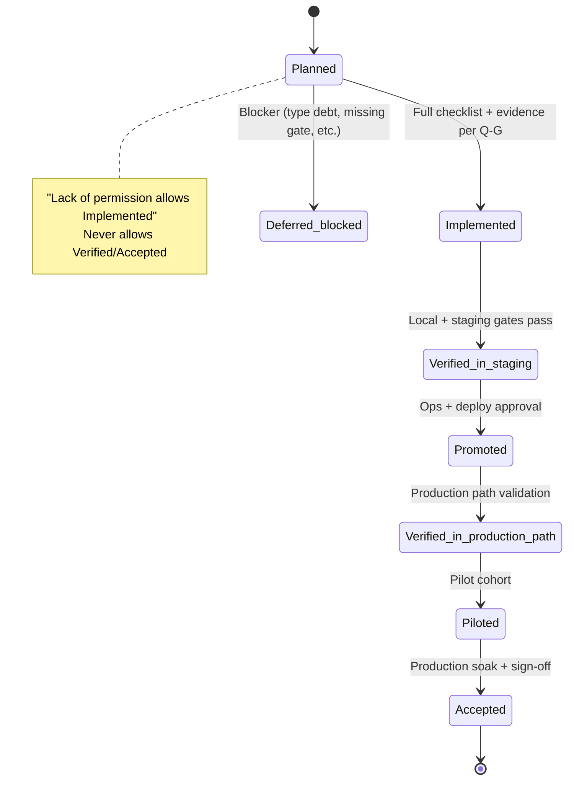
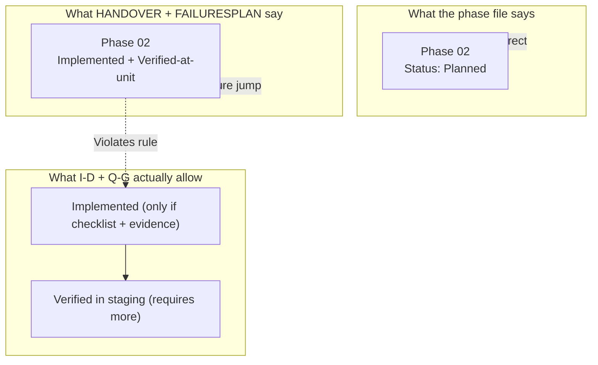

# 03 — Status Vocabulary Drift

**Date:** 2026-07-04  
**Primary documents:** `plannnerplan/IMPLEMENTATION-DECISIONS.md:24-29`, `plannnerplan/QUALITY-GATES.md`, `plans/2026-07-04/benchmark.md`

---

## The Only Allowed Vocabulary

From IMPLEMENTATION-DECISIONS.md:

> Planner phase promotion still uses the `IMPLEMENTATION-DECISIONS.md` vocabulary:  
> `Planned`, `Implemented`, `Verified in staging`, `Promoted`, `Verified in production path`, `Piloted`, `Accepted`, `Deferred/blocked`.

**Critical rule:**
> Lack of permission to run a check allows `Implemented`, **never** `Verified`/`Accepted`.

---

## Declared Lifecycle (Mermaid State Diagram)

---

## Current Violations (as of 2026-07-04)

### Violation 1 — Phase 02

| Location | Claim | Reality | Violation |
|----------|-------|---------|-----------|
| `plannnerplan/phases/02-catalog-source-of-truth-and-blockdescriptor.md:4` | `Status: Planned` | Correct | — |
| `plans/2026-07-04/HANDOVER.md:22` | "Phase 02 — Implemented — unit-verified" | Phase file still Planned + missing Phase 03/06 integration | I-D:24-29 |
| `plannnerplan/FAILURESPLAN.md:59` | "Implemented + Verified-at-unit" + "25/25 cases pass" | Only unit slice; casts still present; loader mismatch | Same + Q-G exit rule |

**Root cause:** The resolver test was treated as sufficient for "Verified-at-unit". The documents require the full gate (schema contract used by 03/04/06, evidence in correct layout, no casts in production path).

### Violation 2 — Evidence Location

- FAILURESPLAN claims: `results/qa/resolver/test-planner/`
- Actual: directory does not exist (`list_dir`).
- Real artifacts live under `results/planner/phase-01/` and `results/tests/`.

This is not just a citation error — it violates the mandated layout in Q-G + testing-handbook.

---

## Visual: Expected vs Claimed Status

---

## Why This Matters (Risk)

1. **Rollback discipline** breaks if we treat something as "Implemented" when it is still Planned.
2. Future agents will read HANDOVER/FAILURESPLAN as truth and compound the error.
3. "Verified-at-unit" language misleads about the scope of the 25/25 test (it is a narrow resolver slice, not full Phase 02 exit).

---

## Recommendation

1. Revert all "Implemented" and "Verified-at-unit" language for Phase 02 in HANDOVER and FAILURESPLAN until:
   - Schema `blocks` field is added (removal of cast)
   - Loader is aligned with Phase 08 pointer semantics
   - Evidence is captured under the correct `results/...` path with full run.json + raw.log
2. Add a note in Phase 02: "Status remains Planned pending Phase 03 + Phase 06 integration and Global Standard Gate checklist."

---

**Related files:**  
- `04-evidence-integrity.md`  
- `05-blockdescriptor-resolver-seams.md`
