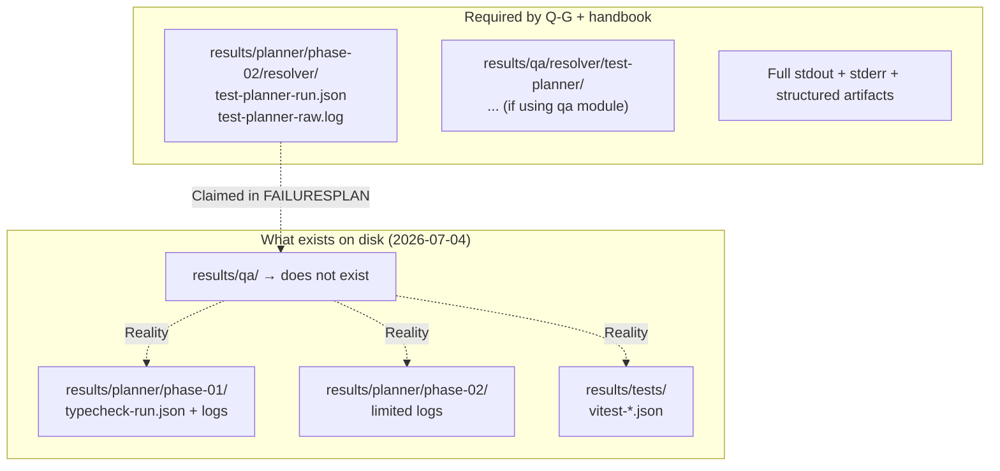

# 04 — Evidence Integrity

**Date:** 2026-07-04  
**Primary rules:** `plannnerplan/QUALITY-GATES.md`, `testing-handbook.md`, `AGENTS.md`

---

## Mandated Evidence Layout

From QUALITY-GATES + testing-handbook:

All test, lint, typecheck, build, Playwright, accessibility, coverage, and audit runs must be captured under:

```
results/<module>/<phase>/<cmd>/
├── <cmd>-run.json
└── <cmd>-raw.log
```

**Never** to the repo root, `E:`, or any other drive path.

A passing assertion count with missing console output / artifacts is **INCOMPLETE**, not passed.

---

## Expected vs Actual (Diagram)



---

## Specific Violations Found

### 1. PLAN-FAIL-0413 / Phase 02 resolver test

- **Claimed:** `results/qa/resolver/test-planner/` with 3 specific files.
- **Reality:** `results/qa/` directory does not exist.
- **Impact:** Violates "evidence integrity" rule. Any future agent trusting the claim will be misled.

### 2. Phase 01 type debt

- Real artifacts exist under `results/planner/phase-01/typecheck/`.
- These correctly show 27 pre-existing errors.
- However, they are not referenced from the Phase 02 "Implemented" claim.

### 3. Broader pattern

Many recent restores and "smoke" runs were intentionally scoped (per Failures.md notes) and therefore correctly left some artifacts out. The problem is that the scoped nature is **not** reflected in the high-level HANDOVER/FAILURESPLAN claims.

---

## Visual Tree of Actual Evidence (partial)

```
results/
├── planner/
│   ├── phase-01/
│   │   ├── typecheck/
│   │   └── ...
│   ├── phase-02/
│   │   └── (limited)
│   └── phase-02-qa/
├── tests/
│   └── vitest-*.json
└── reviews/
    └── critic-review.md   ← this work
```

Missing entirely:
- `results/qa/`
- Standardized `*-run.json` + `*-raw.log` for the resolver-focused run under a proper phase/cmd path.

---

## Why This Is a Bug (not a nit)

- AGENTS.md + testing-handbook + Q-G all treat missing artifacts as **incomplete**.
- "25/25 cases pass" without the accompanying run.json + raw.log is not verifiable.
- This directly undermines the "Verified-at-unit" language.

---

## Recommendation

1. Stop citing `results/qa/resolver/...` until the directory and files are actually created under the correct layout.
2. Re-execute the focused resolver test under a proper harness that produces the mandated artifacts.
3. Update all references in FAILURESPLAN and HANDOVER to point at the real locations (or mark as "scoped smoke — not full gate evidence").

---

**Related:** `03-status-vocabulary-drift.md`
