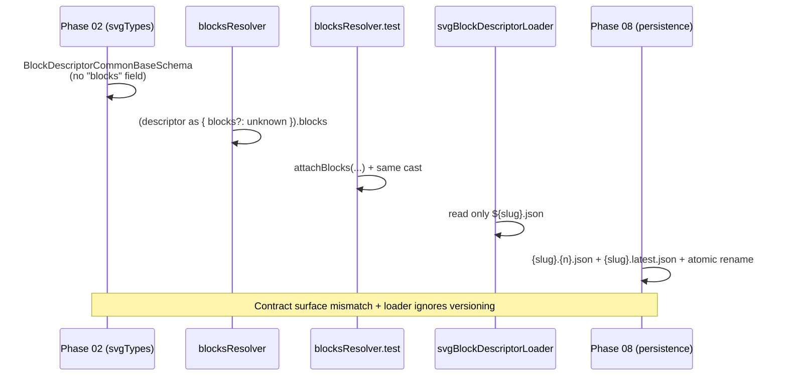

# 05 — BlockDescriptor & Resolver Seams

**Date:** 2026-07-04  
**Key files:** `site/features/planner/open3d/catalog/svg/{svgTypes.ts, blocksResolver.ts, svgBlockDescriptorLoader.ts}`, benchmark BP-02, PLAN-FAIL-0413

---

## The Core Contract Problem

The governance story (I-D + benchmark + Phase 02) promises:

> Single `BlockDescriptor` contract owned in Phase 02, consumed by Phase 03 (generator), Phase 04 (admin), Phase 06 (loader/inventory).

Current reality:



---

## Schema Gap (Detailed)

In `svgTypes.ts`:

```ts
export const BlockDescriptorCommonBaseSchema = z.object({
  // ... many fields
  // NO "blocks" field
});
```

In `blocksResolver.ts:82`:

```ts
const inputBlocks = (descriptor as { blocks?: unknown }).blocks ?? [];
```

The test file deliberately documents the cast as a narrow test-boundary exemption, but the production resolver still carries it.

**PLAN-FAIL-0413** correctly tracks this as a cross-phase handoff (02 → 06).

---

## Loader vs Persistence Mismatch

`svgBlockDescriptorLoader.ts` (current):

- Hardcodes `BLOCK_DESCRIPTORS_DIR_DEFAULT`
- Reads `${slug}.json` directly
- Has a comment claiming it is the Phase 02/06 single source of truth

Phase 08 contract (`08-PERS-02`, `08-PERS-06`, `08-PERS-10`):

- Versioned files: `{slug}.{n}.json`
- Pointer: `{slug}.latest.json`
- Atomic rename on write
- Error taxonomy for 409/422

The loader has **no code path** that understands the pointer or rotation.

---

## Data Flow — Current (Broken) vs Desired

```mermaid
flowchart TD
    subgraph Current["Current (as implemented)"]
        A[Admin Puck → JSON]
        B[json → Zod (no blocks)]
        C[resolver (cast for blocks)]
        D[scripts/generate-svg (Option A)]
        E[write ${slug}.json]
        F[loader reads ${slug}.json only]
    end

    subgraph Desired["Desired (per I-D + Phase 08)"]
        G[Admin → Zod (with blocks: optional)]
        H[resolver (typed, no cast)]
        I[generator]
        J[write {slug}.n.json + update {slug}.latest.json]
        K[loader reads .latest.json → versioned file]
    end

    A --> B --> C --> D --> E --> F
    G --> H --> I --> J --> K
```

---

## Impact

- Phase 02 cannot truthfully claim "single contract" while the `blocks` field is missing and casts are required.
- Phase 06 inventory will either duplicate logic or inherit the cast.
- Phase 08 tests for versioning/rotation cannot be exercised against the loader.
- Any future change to the descriptor shape will be painful because the contract is not yet explicit.

---

## Recommendation (from Critic review)

1. Extend `BlockDescriptorCommonBaseSchema` (and fixed/parametric variants) with:
   ```ts
   blocks: z.array(BlockDescriptorViewBoxSchema.optional()).optional()
   ```
2. Remove the cast from `blocksResolver.ts` (make the field part of the type).
3. Update the test helper to stop using the cast once the schema is honest.
4. Align the loader to Phase 08 pointer semantics (even if Phase 08 implementation is still in progress — the seam must be declared).
5. Add explicit traceability IDs (e.g. `02-CAT-BLOCKS-01`) in Phase 02 checklist pointing at PLAN-FAIL-0413.

---

**See also:**  
- `03-status-vocabulary-drift.md` (why the "Implemented" claim is premature)  
- `06-global-standard-gate.md`
