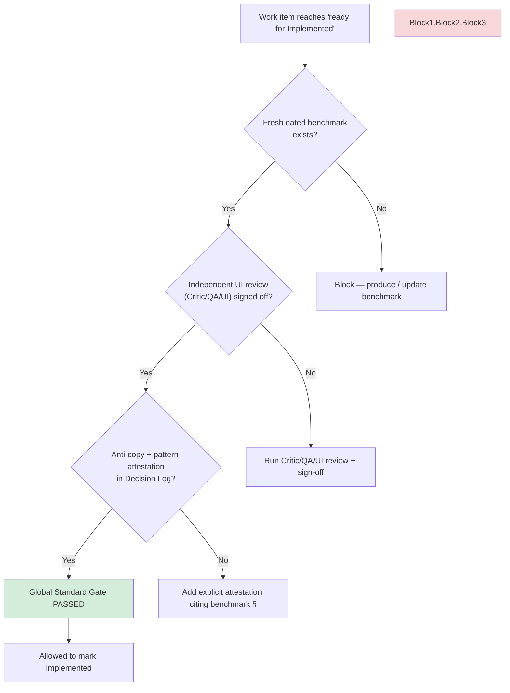

# 06 — Global Standard Gate Compliance

**Date:** 2026-07-04  
**Source rules:** `plannnerplan/IMPLEMENTATION-DECISIONS.md:113-142`, `plannnerplan/QUALITY-GATES.md:66-69`, `plans/2026-07-04/benchmark.md`

---

## The Gate (verbatim)

From I-D:

> Every package, SVG pipeline, feature, and UI decision **must** cite at least one principle from the 2026-07-04 benchmark report.
>
> Global Standard Gate (new in QUALITY-GATES.md): Before "Implemented" on relevant work:
> 1. Fresh dated benchmark report exists.
> 2. Independent UI review (REVIEW-WORKFLOW) signed off.
> 3. Anti-copy + pattern attestation in Decision Log.

Applies to: Phases 03, 04, 05, 06, 10 and all package/SVG/feature/UI changes.

---

## Gate Process (Flowchart)



---

## Current Compliance Snapshot

| Phase / Area | Benchmark cite | Independent review artifact | Anti-copy attestation | GS Gate checklist item | Status |
|--------------|----------------|-----------------------------|-----------------------|------------------------|--------|
| Phase 03 SVG | Partial (BP-03) | No | No | No dedicated section | Incomplete |
| Phase 04 Admin | Yes (BP-04) | This review (partial) | No | Missing | Incomplete |
| Phase 05 Portal | Yes (BP-05) | No | No | Missing | Incomplete |
| Phase 06 Inventory | Partial | No | No | Missing | Incomplete |
| Phase 02 (resolver) | Yes (BP-02) | This review | N/A (not UI-heavy) | N/A | Partial |
| Recent plan updates (HANDOVER/FAILURESPLAN) | Yes (design spec + this benchmark) | This multi-role run | Partial | PLAN-FAIL-0415/16 still open | Incomplete |

---

## What "Independent UI Review" Means Here

The three subagents (Critic / QA / UI) that produced `results/reviews/*.md` are the first execution of the required independent review for the 2026-07-04 global standard revision.

However:
- The reviews are **not yet** referenced from the phase Decision Logs with signed-off dates.
- No artifact was placed under a `results/ui-review/` or `results/global-standard/` path in the mandated format.
- The portal (Phase 05) that would let us visually verify anti-copy has not been scaffolded.

---

## Anti-Copy Rule Status

Benchmark §6 + I-D:

> No donor visual composition, panel arrangement, styling, or information hierarchy unless current evidence independently supports it.

Current state:
- Semantic tokens from `site/app/css/` are used in many places (good).
- Generated assets from Phase 03 exist in goldens but were not exercised in the most recent scoped restores.
- No public `Puck.Render` portal yet to do visual comparison against the 5 reference products.

**Risk:** When Phase 05 lands, we will be doing anti-copy review for the first time against real rendered output. Any drift will be expensive to unwind.

---

## Recommendation

1. Add a dedicated section in Phases 03/04/05/06/10 titled exactly:
   ```
   ## Global Standard Gate (Binding)
   - Fresh dated benchmark: plans/2026-07-04/benchmark.md (2026-07-04)
   - Independent review: results/reviews/critic-review.md + qa-review.md + ui-review.md
   - Anti-copy attestation: [link or note]
   ```
2. After fixes to the top seams, produce a new dated benchmark run (or delta) and place it under `plannnerplan/benchmarks/`.
3. Do not advance the affected phases past "Implemented" until the above section is present and the three bullets are satisfied with links to real artifacts.

---

**Related files in this package:**
- `01-executive-summary.md`
- `07-phase-handoffs-risks.md`
