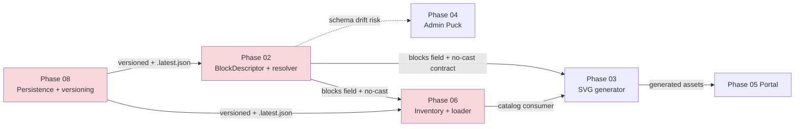
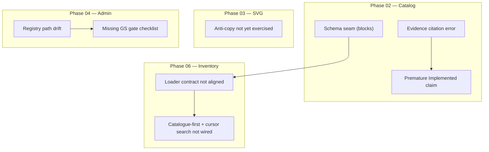

# 07 — Phase Handoffs & Risks

**Date:** 2026-07-04

---

## Major Cross-Phase Seams Currently Open

---

## Key Open Handoffs (with citations)

| From | To | Seam | Current State | Risk Level | Citation |
|------|----|------|---------------|------------|----------|
| Phase 02 | Phase 06 | `blocks` field on descriptor | Cast in resolver + test | High | PLAN-FAIL-0413, benchmark BP-02 |
| Phase 02/06 | Phase 08 | Loader reads plain `.json` | Phase 08 defines pointer + rotation | High | svgBlockDescriptorLoader.ts vs phases/08 |
| Phase 04 | Phase 05 | Registry canonical path | Documented path ≠ actual file + no portal alias yet | Medium-High | I-D:67, PLAN-FAIL-0417 |
| Phase 03 | Phase 05 | Generated assets for visual review | Goldens exist, full run skipped in recent restores | Medium | benchmark §6 anti-copy |
| All | — | Global Standard Gate checklist | BP cites present, dedicated gate section missing | High | I-D:129-130 + Q-G:66-69 |

---

## Risk Heatmap by Phase

---

## Observations (Positive)

- Many BP alignments from the 2026-07-04 benchmark are already present in the phase files (good signal).
- Option A pipeline order is verbatim in Phase 03 and I-D.
- Error taxonomy updates (409 suffixes, 422 for versionMismatch) have landed in several places.
- Live routes table in I-D correctly reflects the hybrid / pilot reality.

---

## Systemic Risk

The biggest systemic risk is **premature status advancement + missing evidence** combined with **contract seams**.

If Phase 02 is treated as "Implemented", later phases will inherit:
- A schema that still requires casts
- A loader that cannot read the versioning scheme Phase 08 is building
- A registry whose documented location is wrong

This is exactly the kind of accumulated technical debt the Global Standard Gate and strict evidence rules were designed to prevent.

---

**Next file:** `08-recommendations-roadmap.md`
