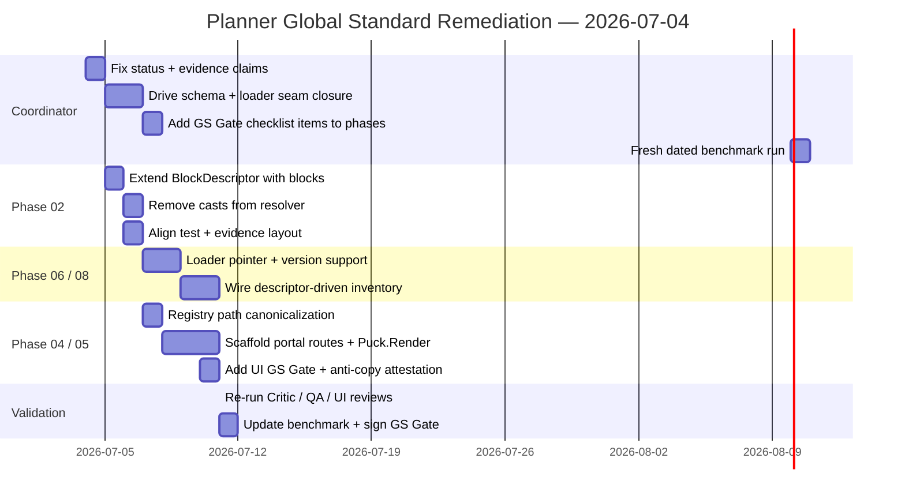

# 08 — Recommendations & Roadmap

**Date:** 2026-07-04

---

## Prioritized Action List

### P0 — Blocking (do before any further Implemented claims)

1. **Status hygiene**
   - Revert "Implemented" and "Verified-at-unit" language for Phase 02 in `HANDOVER.md` and `FAILURESPLAN.md`.
   - Update Phase 02 file header + Decision log to reflect actual state.

2. **Evidence correction**
   - Remove all references to non-existent `results/qa/resolver/...` paths.
   - Either capture real artifacts under the mandated layout or clearly mark the test as "scoped smoke only".

3. **Schema seam (PLAN-FAIL-0413)**
   - Add optional `blocks` array to `BlockDescriptorCommonBaseSchema`.
   - Remove `as { blocks?: unknown }` cast from `blocksResolver.ts`.
   - Update test helper once the type is honest.

4. **Loader alignment**
   - Make `svgBlockDescriptorLoader` understand `{slug}.latest.json` + versioned files (even if full Phase 08 implementation is partial).

5. **Global Standard Gate checklist items**
   - Add explicit `## Global Standard Gate (Binding)` sections to Phases 03, 04, 05, 06, 10 citing this benchmark + the three review files.

### P1 — High (next execution cycle)

6. Registry canonical path — either move the file to the documented location or update all references (I-D, phases, benchmark).
7. Add `## UI Global Standards Gate` subsections (Figma minimize, Sketchfab cursor, catalogue-first, anti-copy attestation).
8. Normalize Phase 00 header to match the 01–10 template.
9. Produce a fresh or delta dated benchmark after the above fixes and place it under `plannnerplan/benchmarks/`.

### P2 — Medium

10. Scaffold the missing admin + portal route pages (currently the biggest visual gap for anti-copy verification).
11. Wire `svgBlockDescriptorLoader` into the inventory UI (Phase 06).
12. Implement cursor-based pagination (≤24) + facets in catalog search per Sketchfab pattern in the benchmark.
13. Run full visual anti-copy review against generated assets once Phase 03 + 05 are exercisable.

---

## Suggested Execution Roadmap (Swimlane)

---

## Success Criteria (before claiming Phase 02/03 "Implemented")

- [ ] Phase 02 file header + all references say `Planned` (or `Implemented` only after checklist)
- [ ] `results/...` paths cited in FAILURESPLAN actually exist and contain `*-run.json` + `*-raw.log`
- [ ] `BlockDescriptorCommonBaseSchema` declares `blocks`
- [ ] Resolver has no production cast for blocks
- [ ] Loader can read `.latest.json` pointer
- [ ] Phases 04/05/06/10 contain explicit "Global Standard Gate" checklist sections with links to this benchmark + review files
- [ ] Independent review (this critic package) is referenced from the Decision Logs

---

## Files in This Critique Package

- `README.md`
- `01-executive-summary.md`
- `02-governance-relationships.md`
- `03-status-vocabulary-drift.md`
- `04-evidence-integrity.md`
- `05-blockdescriptor-resolver-seams.md`
- `06-global-standard-gate.md`
- `07-phase-handoffs-risks.md`
- `08-recommendations-roadmap.md`

All diagrams are embedded Mermaid for direct rendering in GitHub, VS Code, and most Markdown viewers.

---

**End of Critic package.**
