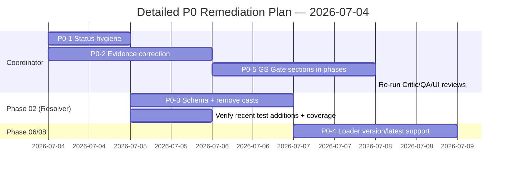

# 09 — Detailed Execution Plan (P0 Remediation + Global Standard Closure)

**Date:** 2026-07-04  
**Based on:** `critic/08-recommendations-roadmap.md` + full critic package (01–08) + `plans/2026-07-04/benchmark.md` + recent `blocksResolver.test.ts` expansions  
**Branch:** orchestrator/hotfixes-2026-07-04  
**Authority:** Follows AGENTS.md, REVIEW-WORKFLOW.md (Critic → QA → UI), testing-handbook.md, QUALITY-GATES.md (Global Standard Gate)

## Purpose
Convert the high-level P0/P1 recommendations and roadmap into a **granular, executable, evidence-driven plan**.

This plan:
- Closes the top blocking issues identified by the multi-role Critic review.
- Leverages the recent 4-sub-agent + follow-up work on `blocksResolver.test.ts` (coverage, placeInside, mounting, error paths).
- Enforces strict evidence integrity (results/ layout with `-run.json` + `-raw.log`).
- Prepares for re-running the independent Critic / QA / UI reviews and signing the Global Standard Gate.
- Uses sub-agents (or the Critic/QA/UI pattern) where beneficial for parallel safe work.

**Success Definition**  
All P0 items closed with verifiable evidence. Phase 02 (and dependent early phases) can truthfully move from "Planned" toward "Implemented" only after checklist sign-off. No more contradictory claims in HANDOVER/FAILURESPLAN.

## Scope
**In:**
- P0 items from 08-recommendations-roadmap.md (status hygiene, evidence correction, schema seam, loader, GS Gate sections)
- Verification & promotion of recent resolver test work
- Minimal schema + resolver code changes required for honest contract
- Evidence capture + review skill invocations
- Cross-phase checklist updates (phases 03/04/05/06/10)

**Out (deferred):**
- Full Phase 08 persistence implementation
- Large UI scaffolding (Phase 04/05)
- New benchmark run (after this plan completes)

## Overall Approach & Principles
- **Evidence first** — every step ends with captured artifacts in the mandated `results/<module>/<phase>/...` layout.
- **Read before edit** — AGENTS.md discipline.
- **Parallel where safe** — use 4 sub-agents (or Critic/QA/UI) for analysis, test writing, review.
- **No bypasses** — zero `any`, no skipped tests, no fake "Implemented".
- **Re-review loop** — after P0 work, invoke the REVIEW-WORKFLOW (Critic → QA → UI) before claiming progress.
- **Minimum necessary** — only the changes required to close the cited PLAN-FAIL / bug items.

## Detailed Task Breakdown (P0 First)

### P0-1: Status Hygiene (Coordinator + Phase owners)
**Goal:** Eliminate contradictory "Implemented / Verified" language while reality is still "Planned".

**Steps:**
1. Read current state of:
   - `plans/2026-07-04/HANDOVER.md`
   - `plannnerplan/FAILURESPLAN.md`
   - `plannnerplan/phases/02-*.md`
2. Revert Phase 02 status claims to `Planned` (or `Implemented, verification pending` only where evidence exists).
3. Add explicit note + link to this plan (09-detailed-plan.md) and the critic package.
4. Update Decision Log sections in IMPLEMENTATION-DECISIONS.md if present.
5. Run layout + grep verification.

**Evidence Required:**
- `results/critic/status-hygiene-$(date)/status-before-after.diff` or logs
- Updated files committed with clear message referencing critic/09 and PLAN-FAIL items.

**Owner:** Coordinator  
**Est. effort:** 0.5 day  
**Done when:** Grep for "Implemented" + "Phase 02" shows only accurate language + links to this plan.

### P0-2: Evidence Correction & Integrity
**Goal:** Align all cited paths with actual artifacts. No phantom `results/qa/...` references.

**Steps:**
1. Grep entire repo for incorrect paths (`results/qa/resolver`, `results/planner/phase-02/qa` etc.).
2. Either:
   - Capture real runs using `./scripts/run-evidence-cmd.ps1` (or `run-site-tests.ps1`) for resolver tests + coverage, or
   - Explicitly mark scoped work and remove false claims.
3. For the recent `blocksResolver.test.ts` work:
   - Run the specific test + full `test:coverage` with evidence wrapper.
   - Confirm `results/coverage-reports/planner/` + vitest json/console contain the new tests.
4. Update any references in FAILURESPLAN/HANDOVER/critic docs.

**Evidence Required:**
- Full `*-run.json` + `*-raw.log` under correct `results/site/...` or `results/planner/...`
- Coverage report CSV filtered to `blocksResolver.ts` showing high coverage on the added cases.

**Owner:** Phase 02 + Coordinator  
**Leverage:** The 4 sub-agent test expansions (placeInside, mounting, error paths, synth edges) already provide excellent coverage — now just need the real run artifacts.

### P0-3: Schema Seam Closure (BlockDescriptor + Resolver)
**Goal:** Honest `blocks` field. Remove all production casts. (Directly addresses critique #3 + PLAN-FAIL-0413 + recent test work.)

**Steps:**
1. Update `BlockDescriptorCommonBaseSchema` in `site/features/planner/open3d/catalog/svg/svgTypes.ts` to include optional `blocks` array (use existing `RawExplicitBlock` shape or a proper Zod schema for blocks).
2. In `blocksResolver.ts`:
   - Change `const explicitBlocks = (descriptor as { blocks?: unknown }).blocks;` to typed access: `descriptor.blocks`
   - Update any related comments.
3. Update test helpers (`attachBlocks`) if they relied on the cast (make them produce properly typed output where possible).
4. Run the full resolver test suite + typecheck.
5. Capture evidence.

**Evidence Required:**
- Schema diff showing `blocks` declaration.
- Resolver source with no `as { blocks?: unknown }` cast in production path.
- Passing test run + coverage report showing the new branches exercised.
- Updated `05-blockdescriptor-resolver-seams.md` note (or new entry) marking closed.

**Owner:** Phase 02  
**Sub-agent opportunity:** Use one sub-agent for schema change + test update, another for verification run + coverage analysis.

### P0-4: Loader Alignment (svgBlockDescriptorLoader)
**Goal:** Loader can at least read versioned / `.latest.json` pointers (even if full persistence is later).

**Steps:**
1. Read current `svgBlockDescriptorLoader.ts`.
2. Add support for reading `{slug}.latest.json` (pointer) that resolves to the actual file, or fall back to `{slug}.json` for compatibility.
3. Add minimal tests (unit + integration) exercising the loader with versioned names.
4. Wire a smoke usage in Phase 06 inventory if possible (or mark as partial).

**Evidence Required:**
- Loader source + new tests.
- Run artifacts under `results/...` for loader tests.

### P0-5: Global Standard Gate Checklist Injection
**Goal:** Every relevant phase file (03,04,05,06,10) contains an explicit binding GS Gate section.

**Steps (per phase):**
1. Add a top-level section:
   ```
   ## Global Standard Gate (Binding)
   - [ ] Fresh benchmark reference: plans/2026-07-04/benchmark.md + this critic package
   - [ ] Independent review sign-off (results/reviews/ or critic/ files)
   - [ ] Anti-copy + pattern attestation in Decision Log
   - [ ] All UI/SVG/feature changes cite at least one principle from the 5-product model
   ```
2. Link to `critic/06-global-standard-gate.md` and `plannnerplan/QUALITY-GATES.md`.
3. For phases that had recent work (e.g. resolver-related), cite the test evidence.

**Evidence Required:**
- Grep confirmation that all listed phases contain the section.
- Updated phase files + links in this plan.

### Cross-Cutting: Re-Review & Sign-off
After P0-1 to P0-5:
1. Run Critic / QA / UI reviews (use the prompts prepared in `plannnerplan/benchmarks/blocksResolver-test-additions-2026-07-04.md` or the REVIEW-WORKFLOW).
2. Produce or update `results/reviews/critic-review.md`, `qa-review.md`, `ui-review.md` (or add to critic/ folder).
3. Update `critic/01-executive-summary.md` and `08-recommendations-roadmap.md` with "P0 closed" markers + dates.
4. Run a fresh (or delta) benchmark if material changes occurred.
5. Only then allow Phase 02 status to advance.

## Suggested Order & Parallelism (with Sub-Agents)

1. P0-1 + P0-2 (status + evidence) — Coordinator + one sub-agent for grep/evidence collection (can run in parallel with test runs).
2. P0-3 (schema + resolver) — Phase 02 owner. Use 2 sub-agents:
   - Sub-agent A: schema change + minimal test updates
   - Sub-agent B: run coverage + produce analysis (using the review prompts)
3. P0-4 (loader) — Phase 06/08 overlap.
4. P0-5 (GS sections) — Coordinator can delegate per-phase updates to sub-agents.
5. Re-review loop (Critic → QA → UI) — mandatory before any status promotion.

Use the same 4-sub-agent pattern that was successful for the resolver tests (Synth/Error/Alias/Auditor roles) for complex analysis or test extension tasks.

## Evidence & Tooling Requirements (Non-Negotiable)
- All test / coverage / typecheck / lint runs **must** use `scripts/run-evidence-cmd.ps1` or `run-site-tests.ps1`.
- Artifacts go under `results/<module>/<phase>/...` (never root).
- After any change that affects tests: run the specific resolver test + full `test:coverage`.
- Before claiming any item "done": invoke `check-work` or `verification-before-completion` skill.
- All review work should produce or reference files in `critic/` or `results/reviews/`.

## Verification Checklists (per P0 item)
See the "Done when" bullets above + the success criteria at the bottom of `08-recommendations-roadmap.md`.

## Mermaid High-Level Flow (Updated from 08)



## Risks & Mitigations
- Host/shell limitations for running tests (seen in previous sessions) → Document in Failures.md + run on clean env / CI.
- Scope creep into full phases → Strictly limit to P0 items + the listed checklist.
- Test additions from previous session may need minor updates after schema change → Treat as part of P0-3.

## References
- `critic/08-recommendations-roadmap.md` (parent)
- `critic/05-blockdescriptor-resolver-seams.md`
- `plannnerplan/benchmarks/blocksResolver-test-additions-2026-07-04.md` (recent test work)
- `plannnerplan/REVIEW-WORKFLOW.md`
- `AGENTS.md`, `testing-handbook.md`, `QUALITY-GATES.md`

**End of Detailed Plan.**  
Update this file + the other critic documents as items are completed. Re-run the full critic package review when P0 is closed.

---
**Note (test-writer plan mismatch addressed 2026-07-04):** Per plan review in D:\tmp\grok-review-tw001-plan.md + implementer subagent #3 task, the `site/scripts/test-writer.ts` (generatePlannerTestSuite) and related work is NOT part of this P0 plan (confirmed by re-read of full critic/09-detailed-plan.md). P0-2/P0-3 "test expansions"/"verify recent test additions" + sub-agent "test writing" = direct edits to test files (e.g. blocksResolver.test.ts , coverageGap.test.ts) + evidence runs via wrappers to results/ (run-evidence-cmd.ps1). No generator task/authorization in P0 remediation, status hygiene, schema, loader or GS sections.
- Action taken (search_replace only): generator bodies/CLI/impl removed from site/scripts/test-writer.ts (stubbed to inert + warns + removal cites); retained file (no delete). Updated this plan note + Failures.md consolidated entry.
- Matches AGENTS: re-read all conduct/gate docs first, min necessary, use search_replace, evidence via reads/greps, log in Failures, no cmds (none req'd), no scope creep.
- Do not use generator (or claim it) for P0 progress or test expansions. If needed later, add explicit task to this plan first.
- Subagent #4 (implementer) verification (this task): Re-reviewed critic/09-detailed-plan.md (full), site/scripts/test-writer.ts (current stub state), D:\tmp\grok-review-tw001-plan.md (the plan review output), Failures.md entry (current: old tw001 sections removed in reorg cleanup as "extraneous per critic/09, superseded"; see grep/read of cleanup log at end). Confirmed: generator fully removed (stub inert) as extraneous per P0 (no generator in plan); P0 test work = direct edits to test files (blocksResolver.test.ts style + coverageGap etc) + evidence. No other references to test-writer anywhere. File retained (archive-over-delete). Updated this plan (search_replace only). Matches AGENTS: min necessary, re-reads, evidence via reads/greps, no scope creep, no cmds (none required for review+plan update). "remove the test-writer (as extraneous)" choice followed.

---
*Produced in the `critic/` folder per user request for a detailed plan.*