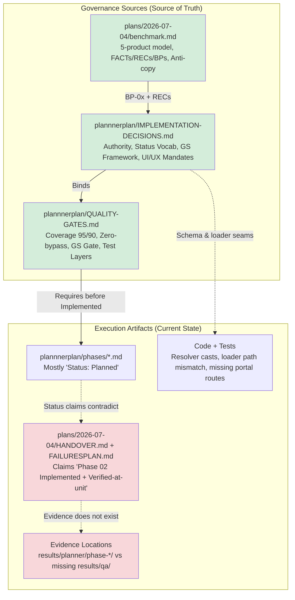

# Critic — Detailed Structured Critique (2026-07-04)

**Location:** `archive/plans/2026-07-04/critic/` (historical). Active short critique: `plans/2026-07-04/critique.md` and `plans/planner Phase1/CRITIQUE-2026-07-04.md`.

**Purpose**  
This folder contains the expanded, multi-document critique of the planner governance and execution state. It was produced following the multi-role review (Critic / QA / UI) that read:

- `plans/2026-07-04/benchmark.md`
- `plannnerplan/IMPLEMENTATION-DECISIONS.md`
- `plannnerplan/QUALITY-GATES.md`

Context: branch `orchestrator/hotfixes-2026-07-04`, recent updates to plan documents + `blocksResolver.test.ts`, hybrid Fabric + Open3D pilot work.

**Scope & Method**  
- Read-only analysis (AGENTS.md compliant).
- Structured findings with severity, citations, suggestions.
- Heavy use of diagrams (Mermaid) for relationships, flows, gates, and risks.
- Builds directly on the single-file `results/reviews/critic-review.md` but split into focused, detailed documents.

## Document Index

| File | Focus | Key Diagrams |
|------|-------|--------------|
| `01-executive-summary.md` | Overall verdict, top risks, coherence assessment | High-level governance overview |
| `02-governance-relationships.md` | How the three source-of-truth documents relate and bind phases | Mermaid flowchart of authority & data flow |
| `03-status-vocabulary-drift.md` | Vocabulary rules vs actual claims in HANDOVER/FAILURESPLAN/phases | State diagram (Planned → ... → Accepted) + drift callouts |
| `04-evidence-integrity.md` | Testing handbook + Q-G requirements vs actual artifacts on disk | Expected vs actual results/ tree diagram |
| `05-blockdescriptor-resolver-seams.md` | Schema, resolver casts, loader vs persistence handoffs | Sequence diagram + data model diff |
| `06-global-standard-gate.md` | Binding Global Standard Gate (I-D + Q-G) compliance | Gate process flowchart + phase checklist matrix |
| `07-phase-handoffs-risks.md` | Cross-phase ownership, PLAN-FAIL seams, registry drift | Dependency graph + risk heatmap |
| `08-recommendations-roadmap.md` | Prioritized actions + suggested execution order | Timeline / swimlane roadmap |
| `09-detailed-plan.md` | Granular executable steps, evidence requirements, sub-agent usage, verification for all P0 items (builds on 08) | Task breakdown + Gantt + checklists |

## Quick Visual Summary (Governance Coherence)

## Severity Legend
- **bug** — violates a binding rule (I-D, Q-G, benchmark gate, AGENTS.md)
- **suggestion** — improvement or missing cross-link that increases risk
- **nit** — consistency / hygiene item

All issues are tracked as "open" until the owning phase or coordinator closes them with evidence.

**Next Step Recommendation**  
Coordinator should drive resolution of the top 5 gaps (status hygiene, evidence paths, 3 handoff seams) before any further "Implemented" claims on Phases 02–04. A fresh dated benchmark + independent GS review should follow.

See individual files for full detail + diagrams.
