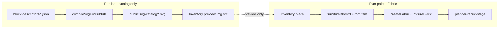

# P05 / CP-05 — Symbols + SVG honesty close plan

> **For agentic workers:** REQUIRED SUB-SKILL: Use superpowers:subagent-driven-development (recommended) or superpowers:executing-plans. Steps use checkbox (`- [ ]`) syntax.
>
> **Plan skill:** writing-plans-repo-brainstorm (repo first → brainstormer reports → extensive plan, no length cap).

**Goal:** Close **P05 / CP-05** honestly: cabinet-v0 multiprim readable on live Fabric; published `/svg-catalog/*.svg` multipath quality fixed; stale tests/docs no longer claim catalog SVG is plan-draw.

**Architecture:** Two paths stay separate forever — **plan paint** = `PlannerFabricStage` → `createFabricFurnitureBlock` (Block2D multiprim); **publish** = `compileSvgForPublish` → `public/svg-catalog/{slug}.svg` (inventory/admin only). CP-05 closes when both paths are proven on this checkout with fresh commands + evidence under `05-symbols-svg/`.

**Tech stack:** Fabric 7.4 · Next.js planner workspace · Vitest · Playwright · `compileSvgForPublish` / `runSvgCompileStages` · block descriptors in `site/block-descriptors/`.

**Inputs consumed:**
- Repo read: 2026-07-12 HEAD `4ddfa36a` (clean product tree; audit artifacts untracked in `agents-work/`)
- Brainstormer: **none** — `Idiots/` and `Idiots2/` absent; substituted with `agents-work/*-2026-07-12.md` live audits
- Phase card: `Plans/Planner-track/P05-symbols-svg.md` · BOARD next-open
- Live audits: `CANVAS-ROUTE-UI`, `HEIGHT-CHAIN-LIVE`, `CHROME-AUDIT-LIVE`

**Owner rules (hard):**
- **No commit/push without explicit owner permission** — every commit step is gated; land only when owner says so.
- **No paper moon** — `results/` dumps ≠ PASS; Plans updated only after fresh live proof.

**Done when (buyer-visible):**
1. Place **Modular Cabinet** on `/planner/guest` → canvas shows multiprim (body/door/handle), not cream blob — PNG in evidence.
2. `GET /svg-catalog/chaise-lounge-001.svg` has **≥3** pathish elements (`path`/`rect`/`line`) after re-publish.
3. `open3d-p05-cabinet-multiprim.spec.ts` green; publish multipath unit/e2e green; **no** e2e claims plan canvas uses `drawImage` on `/svg-catalog/`.
4. `Plans/Planner-track/P05-symbols-svg.md` + `CHECKPOINTS.md` CP-05 → **PASS** or **PASS slice** with named residual only if owner waives publish half.

**Evidence folder:** `results/planner/world-standard-wave/05-symbols-svg/` (HEAD.txt · vitest logs · browser PNGs · VERDICT.md)

---

## Why the owner saw “no change”

Prior session work was **read-only**:

| What happened | Visible in browser? |
|---------------|-------------------|
| UI audit reports in `agents-work/*-2026-07-12.md` | No |
| Playwright screenshots in `results/planner/` | No (unless owner opens files) |
| Product code edits | **None committed**; height-chain fix already on HEAD `4ddfa36a` |
| Subagent scripts (`canvas-route-playwright.mjs`, `chrome-audit-live.ts`) | Untracked in `agents-work/` |

**Live UI today** at `http://localhost:3000/planner/canvas/?plannerDevTools=1`:
- With `DEV_AUTH_BYPASS=1` → **Project Setup wizard** first (2 steps), then workspace — see `agents-work/CANVAS-ROUTE-UI-2026-07-12.md`.
- `/planner/guest/?plannerDevTools=1` → workspace **directly** (guest skips gate).
- Height chain + chrome audits: **GREEN** on current HEAD — not a pending code land.

This plan targets **visible product delta**: better published SVG + honest tests + CP-05 close.

---

## 1. Repo reality

### What exists (verified)

| Area | Path | State |
|------|------|-------|
| Sole 2D host | `site/features/planner/canvas/PlannerFabricStage.tsx` | `data-testid="planner-fabric-stage"`, `open3d-canvas-embedded` class on HEAD |
| Multiprim paint | `site/features/planner/canvas/fabricBlock2D.ts` → `createFabricFurnitureBlock` | Wired in stage rebuild loop |
| Block2D library | `site/features/planner/project/catalog/furnitureBlock2D.ts` | `furnitureBlockUsesCenteredPath` → false |
| Publish compile | `site/features/planner/asset-engine/svg/compileSvgForPublish.ts` | S1–S3 authority |
| Chaise descriptor | `site/block-descriptors/chaise-lounge-001.json` | **2 blocks** (seat + backrest) |
| Published chaise | `site/public/svg-catalog/chaise-lounge-001.svg` | **1 `<path>`** (difference merge) — **fails multipath bar** |
| P05 browser (cabinet) | `site/tests/e2e/open3d-p05-cabinet-multiprim.spec.ts` | Cabinet eyes PASS per prior dump |
| CP05 browser (stale) | `site/tests/e2e/open3d-cp05-symbols-s7.spec.ts` | Header claims plan draws `/svg-catalog/` — **contradicts P05 card + Lockedfiles** |
| Canvas route | `site/app/planner/(workspace)/canvas/page.tsx` | `guestMode = !user`; dev bypass forces member wizard |

### Contradictions (must fix in this plan)

| Claim | Truth on disk |
|-------|----------------|
| `open3d-cp05-symbols-s7.spec.ts` “canvas must drawImage published SVG” | Live plan uses Block2D multiprim only; `svgPlanSymbolCache` unwired |
| `asset-engine/stages.ts` S7 wording (plan-canvas SVG draw) | Stale vs Fabric multiprim |
| P05 card “CP-05 not PASS” vs cabinet e2e PASS | Publish multipath residual blocks full gate |
| `CHECKPOINTS.md` CP-09 **REPROVE** vs BOARD **PASS** | Plans drift — reconcile in Task 6 |

### Live audits (2026-07-12, not gate PASS)

- **Height chain:** GREEN @ 1920×1080 and 2560×1440 — `agents-work/HEIGHT-CHAIN-LIVE-2026-07-12.md`
- **Chrome:** GREEN, 0 console errors — `agents-work/CHROME-AUDIT-LIVE-2026-07-12.md`
- **Canvas route:** Setup wizard → workspace; fabric stage reached — `agents-work/CANVAS-ROUTE-UI-2026-07-12.md`

### Missing tracked docs (restore in Task 6)

- `agents-work/CANVAS-NOTES.md`, `TOOLBAR-NOTES.md`, `LAYOUT-OVERFLOW.md`, `P05-SVG-HONESTY-NOTES.md` — referenced in audits but absent on HEAD

---

## 2. Brainstormer synthesis (substitute — no Idiots reports)

**Status:** `Idiots/` and `Idiots2/` **not on disk**. Owner invoked plan without brainstormer wave — proceeding repo-only per skill waiver.

**Bar imported from Plans + audits:**

| Bar | Source |
|-----|--------|
| Fabric sole 2D | P02 / CONSTRAINTS |
| SVG catalog = publish only | P05, `docs/Lockedfiles/02-svg-pipeline-current.md` |
| W2 symbol half = cabinet multiprim readable | P05 kill order (slice A done) |
| No competitor copy | AGENTS.md |
| 5k before marathon | BOARD owner calibration |

**Failure modes to block:**

| Trap | Block |
|------|-------|
| Pass CP-05 on cabinet only while chaise publish still 1-path | Task 2–4 require publish multipath |
| Re-wire plan canvas to `/svg-catalog/` | Forbidden — fix tests instead |
| Count-only e2e | PNG + pathish count + diversity probe |
| Commit without owner | Every commit step gated |

---

## 3. Ethics / non-copy

- Research/competitive ideas → product steps only; no asset theft.
- Publish SVG fix = **our** descriptor + pipeline output, not competitor SVGs.

---

## 4. File map

| Action | Path |
|--------|------|
| **Modify** | `site/features/planner/asset-engine/svg/runSvgCompileStages.ts` or block-emission helper — multi-rect → multi-path output for publish |
| **Modify** | `site/public/svg-catalog/chaise-lounge-001.svg` — regenerated via publish script |
| **Modify** | `site/tests/e2e/open3d-cp05-symbols-s7.spec.ts` — split publish vs plan assertions |
| **Modify** | `site/features/planner/asset-engine/stages.ts` — stale S7 text |
| **Create** | `site/tests/unit/features/planner/asset-engine/publishMultipath.test.ts` |
| **Create** | `agents-work/P05-SVG-HONESTY-NOTES.md` (restore) |
| **Create** | `results/planner/world-standard-wave/05-symbols-svg/HEAD.txt` + `VERDICT.md` |
| **Modify** | `Plans/Planner-track/P05-symbols-svg.md`, `CHECKPOINTS.md` (after proof only) |
| **Optional** | `site/app/planner/(workspace)/canvas/page.tsx` or dev bypass docs — setup friction |

---

## 5. Architecture & data flow



**CP-05 closes both:**
- **D** shows multiprim cabinet (already green — re-prove)
- **G** chaise has ≥3 pathish elements (red today — fix pipeline or variant)

---

## 6. Task list

### Task 0: Baseline reprove (no code)

**Files:** evidence only

- [ ] **Step 1: Confirm dev server**

Run: `curl.exe -s -o NUL -w "%{http_code}" "http://localhost:3000/planner/guest/?plannerDevTools=1"`  
Expected: `200`

- [ ] **Step 2: Unit baseline**

Run from repo root:
```bash
pnpm --filter oando-site exec vitest run \
  site/tests/unit/features/planner/modularCabinetV0.test.ts \
  site/tests/unit/features/planner/fabricBlock2D.test.ts \
  --reporter=verbose
```
Expected: all tests PASS (record counts in `05-symbols-svg/cabinet-v0-multiprim-units.log`)

- [ ] **Step 3: Publish file honesty**

Run:
```bash
curl.exe -s "http://localhost:3000/svg-catalog/chaise-lounge-001.svg" | findstr /i "<path <rect <line"
```
Expected today: **1** pathish — record as RED baseline in `VERDICT.md`

- [ ] **Step 4: Write HEAD.txt**

```bash
git rev-parse HEAD > results/planner/world-standard-wave/05-symbols-svg/HEAD.txt
```

**Commit:** none

---

### Task 1: Failing unit — publish multipath contract

**Files:**
- Create: `site/tests/unit/features/planner/asset-engine/publishMultipath.test.ts`
- Read: `site/block-descriptors/chaise-lounge-001.json`
- Read: `site/features/planner/asset-engine/svg/compileSvgForPublish.ts`

- [ ] **Step 1: Write failing test**

```typescript
import { describe, expect, it } from "vitest";
import fs from "node:fs";
import path from "node:path";
import { compileSvgForPublish } from "@/features/planner/asset-engine/svg/compileSvgForPublish";

function countPathish(svg: string): number {
  return (
    (svg.match(/<rect\b/gi) ?? []).length +
    (svg.match(/<path\b/gi) ?? []).length +
    (svg.match(/<line\b/gi) ?? []).length
  );
}

describe("publishMultipath — chaise-lounge-001", () => {
  it("compileSvgForPublish emits >= 3 pathish elements for 2-block descriptor", async () => {
    const raw = JSON.parse(
      fs.readFileSync(
        path.join(process.cwd(), "block-descriptors/chaise-lounge-001.json"),
        "utf8",
      ),
    );
    const result = await compileSvgForPublish(raw);
    expect(result.ok).toBe(true);
    if (!result.ok) return;
    const svg = result.svg;
    expect(countPathish(svg)).toBeGreaterThanOrEqual(3);
    // Each block should be visually distinct — not one merged difference path only
    expect(svg).toMatch(/<(?:path|rect|line)\b[^>]*>/i);
  });
});
```

- [ ] **Step 2: Run test — expect FAIL**

Run: `pnpm --filter oando-site exec vitest run site/tests/unit/features/planner/asset-engine/publishMultipath.test.ts --reporter=verbose`  
Expected: FAIL — `countPathish` returns 1

**Commit:** only if owner asks — `test(p05): publish multipath contract for chaise fixture`

---

### Task 2: Fix publish compile — multi-block → multi-path SVG

**Files:**
- Modify: `site/features/planner/asset-engine/svg/runSvgCompileStages.ts` and/or polygon/Maker emit path
- Reference: `normalizeDescriptorForPipeline.ts` (variant `difference` for 2+ blocks)

**Approach (repo-winning):** For publish output, when descriptor has **≥2 blocks** and goal is inventory preview richness, emit **one SVG primitive per block** (grouped under `<g>`) instead of single boolean-difference silhouette. Do **not** change Fabric plan path.

- [ ] **Step 1: Trace emit path**

Read `runSvgCompileStages` → pipelineCore output for `chaise-lounge-001` with 2 blocks. Document whether `difference` merge is intentional for 3D extrusion only.

- [ ] **Step 2: Implement minimal emit change**

Preferred: add publish flag or detect inventory publish context so `difference` merge is skipped for multi-block **footprint** descriptors; emit:

```xml
<g data-block-id="seat-block"><rect .../></g>
<g data-block-id="backrest-block"><rect .../></g>
```

(or equivalent paths per block mm geometry)

- [ ] **Step 3: Re-run unit — expect PASS**

Run: `pnpm --filter oando-site exec vitest run site/tests/unit/features/planner/asset-engine/publishMultipath.test.ts`  
Expected: PASS

- [ ] **Step 4: Regenerate public SVG**

Run existing publish script or admin pipeline for `chaise-lounge-001` (whichever repo uses — check `publishDescriptorWithPipeline` / `generate-svg.mjs`).  
Verify: `site/public/svg-catalog/chaise-lounge-001.svg` updated on disk.

**Commit:** only if owner asks — `fix(p05): publish multi-block SVG as separate pathish primitives`

---

### Task 3: E2E honesty — split plan vs publish proofs

**Files:**
- Modify: `site/tests/e2e/open3d-cp05-symbols-s7.spec.ts`
- Keep: `site/tests/e2e/open3d-p05-cabinet-multiprim.spec.ts` (cabinet eyes)

- [ ] **Step 1: Rewrite cp05 spec header + assertions**

Remove claims that plan canvas `drawImage`s `/svg-catalog/`. Structure:

1. **Publish HTTP proof** — `GET /svg-catalog/chaise-lounge-001.svg` pathish ≥ 3
2. **Inventory preview proof** — catalog `img[src*="/svg-catalog/"]` visible
3. **Plan proof (separate)** — place chaise → Fabric multiprim or Block2D diversity on `PLANNER_PAINT_CANVAS` (same pattern as cabinet spec); **do not** wait for svg-catalog network on canvas paint

- [ ] **Step 2: Run cabinet spec**

```bash
cd site && pnpm exec playwright test tests/e2e/open3d-p05-cabinet-multiprim.spec.ts --reporter=list
```
Expected: PASS + PNG `p05-scratch-cabinet-canvas.png`

- [ ] **Step 3: Run cp05 spec**

```bash
cd site && pnpm exec playwright test tests/e2e/open3d-cp05-symbols-s7.spec.ts --reporter=list
```
Expected: PASS after Task 2

**Commit:** only if owner asks — `test(p05): honest split publish multipath vs Fabric plan paint`

---

### Task 4: Evidence pack + Plans update

**Files:**
- Create: `results/planner/world-standard-wave/05-symbols-svg/VERDICT.md`
- Modify: `Plans/Planner-track/P05-symbols-svg.md`
- Modify: `Plans/Planner-track/CHECKPOINTS.md` (CP-05 row only)

- [ ] **Step 1: Run full P05 evidence script**

Collect into `05-symbols-svg/`:
- `HEAD.txt`
- `cabinet-v0-multiprim-units.log`
- `publishMultipath.test.ts` output
- `browser/*.png` from both e2e specs
- `VERDICT.md` with PASS/FAIL per slice

- [ ] **Step 2: Update P05 card**

Set status **PASS** only if both slices green; else **PASS slice** (Fabric) + named residual (publish).

- [ ] **Step 3: Align CHECKPOINTS CP-05**

Match BOARD; fix CP-09 drift if still inconsistent.

**Commit:** only if owner asks — `docs(planner): CP-05 PASS with evidence paths`

---

### Task 5: Stale doc cleanup

**Files:**
- Modify: `site/features/planner/asset-engine/stages.ts` (S7 description)
- Create: `agents-work/P05-SVG-HONESTY-NOTES.md`

- [ ] **Step 1: Fix stages.ts S7 text**

Replace plan-canvas SVG draw claim with: publish = `compileSvgForPublish`; plan = Fabric Block2D.

- [ ] **Step 2: Restore honesty NOTES**

Two-path table (plan paint vs publish) — copy structure from prior session audit.

**Commit:** only if owner asks

---

### Task 6: Optional — canvas route UX clarity

**Problem:** `DEV_AUTH_BYPASS=1` makes `/planner/canvas/` show member setup wizard; owner may think product is stuck.

**Files:** document in `agents-work/CANVAS-ROUTE-UI-2026-07-12.md` (exists) or `Readme.md` snippet — **no code change required** unless owner wants `?guest=1` bypass.

- [ ] **Step 1: Owner decision**

Options:
- A) Document only: “use `/planner/guest/` for instant workspace in dev”
- B) Code: `plannerDevTools=1` forces guestMode on canvas route (owner explicit)

**Default:** A only (YAGNI)

**Commit:** only if owner asks

---

## 7. Test matrix

| Layer | Command | Pass bar |
|-------|---------|----------|
| Unit multipath | `vitest run publishMultipath.test.ts` | pathish ≥ 3 |
| Unit cabinet | `vitest run modularCabinetV0.test.ts` | green |
| E2E cabinet eyes | `playwright open3d-p05-cabinet-multiprim.spec.ts` | PNG multiprim |
| E2E publish | `playwright open3d-cp05-symbols-s7.spec.ts` | HTTP + inventory; no false plan-svg claim |
| Live height | Playwright guest URL 1920 + 2560 | scrollH = innerH (already green) |
| Console | guest workspace load | 0 errors (already green) |

---

## 8. False-green catalog

| Trap | Detection | Block |
|------|-----------|-------|
| PASS CP-05 on units only | No browser PNG | Task 3 e2e required |
| PASS on cabinet only | Chaise still 1-path | Task 1–2 |
| Re-add svg-catalog plan draw | cp05 waits for canvas svg response | Remove assertion |
| Inventory thumb = plan paint | Place chaise, probe Fabric only | Task 3 |
| Old results/ as PASS | Fresh HEAD.txt this session | Task 4 |

---

## 9. Stop-if-fail

Stop and log `Failures.md` if:
- Fabric host testid changes from `planner-fabric-stage`
- Second plan canvas introduced
- `compileSvgForPublish` authority moved without owner
- Locked CSS `core/locked/**` edit required for P05 (should not be)

---

## 10. Commit sequence (owner permission required for each)

1. `test(p05): publish multipath contract` — Task 1  
2. `fix(p05): multi-block publish SVG primitives` — Task 2  
3. `test(p05): honest cp05 e2e split` — Task 3  
4. `docs(planner): CP-05 evidence + card update` — Task 4  
5. `docs(p05): SVG honesty notes + stages text` — Task 5  

**Never push without owner ask.**

---

## 11. Risks & owner decisions

| Risk | Mitigation |
|------|------------|
| Changing publish emit breaks 3D extrusion | Run `makerJsPipeline.test.ts` + `scenePublishAuthority.test.ts` in Task 2 |
| Owner expected visible UI change from audit | This plan explains audits ≠ product; P05 publish fix may only change inventory thumbs |
| `DEV_AUTH_BYPASS` setup friction | Task 6 doc or explicit bypass |
| No brainstormer reports | Repo-only plan; run Idiots2 wave later if owner wants JTBD depth |

**Owner decisions needed:**
1. Approve publish emit change (multi-path vs difference silhouette)?
2. Waive publish half and take PASS slice on Fabric only?
3. Any commit from sequence §10?

---

## 12. Self-review

| Check | Status |
|-------|--------|
| Repo paths exist | ✅ verified |
| P05 BOARD next-open | ✅ |
| Brainstormer | ⚠️ missing — documented |
| Placeholders | ✅ none |
| Commit gated | ✅ owner permission |
| Explains “no visible change” | ✅ |
| Does not wire svg-catalog to plan | ✅ |

---

## Execution handoff

**Plan saved to:** `agents-work/2026-07-12-p05-symbols-svg-close-plan.md`

**Two execution options:**

1. **Subagent-Driven (recommended)** — superpowers:subagent-driven-development, one task per slice, review between tasks, **no commit unless owner says**

2. **Inline Execution** — superpowers:executing-plans in this session with checkpoints

**Which approach?**