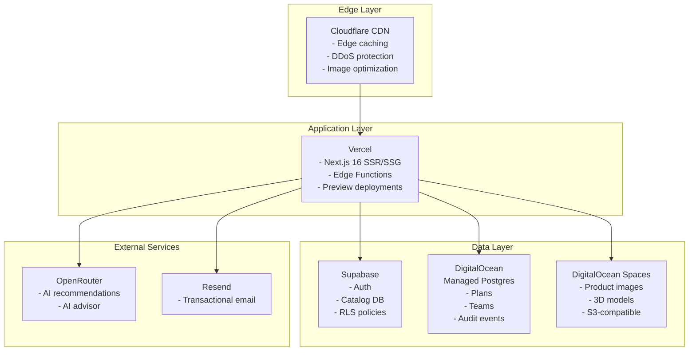
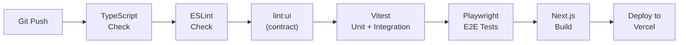

# Deployment Architecture

**Status:** Live reference (light-touch maintenance only)  
**Authority:** `Readme.md` → **this file** → [`docs/Lockedfiles/INDEX.md`](../Lockedfiles/INDEX.md)  
**Index:** [`README.md`](README.md) · [`MODULE-LAYOUT.md`](MODULE-LAYOUT.md)  
**Locked baseline:** [`docs/Lockedfiles/architecture/current.md`](../Lockedfiles/architecture/current.md) · [`proposed.md`](../Lockedfiles/architecture/proposed.md)  
**Related:** [`COMPONENT_ARCHITECTURE.md`](COMPONENT_ARCHITECTURE.md), [`DATA_FLOW.md`](DATA_FLOW.md)

> Topology unchanged as of 2026-07-05. Update only when Vercel/Supabase/DO configuration changes.

---

## Deployment topology



---

## Vercel configuration

**Build settings (monorepo — run from repo root):**

- Framework: Next.js 16
- Root directory on Vercel: `site`
- Install: `corepack enable && cd .. && pnpm install --frozen-lockfile && cd site` (see `site/vercel.json`)
- Build command: `pnpm --filter oando-site run build` (or `next build` when cwd is `site/`)
- Output directory: `.next`
- Node.js version: 20+

**Environment variables (production):**

- `NEXT_PUBLIC_SUPABASE_URL` — Supabase project URL
- `NEXT_PUBLIC_SUPABASE_ANON_KEY` — Supabase anonymous key
- `SUPABASE_ADMIN_SERVICE_ROLE_KEY` — Server-side service role
- `NEXT_ADMIN_SUPABASE_URL` — Admin Supabase URL
- `PRODUCTS_DATABASE_URL` — Products Supabase (catalog, Drizzle)
- `SUPABASE_AUTH_DATABASE_URL` — Admin/planner Supabase (Drizzle)
- `OPENROUTER_API_KEY_PRIMARY` and `OPENROUTER_API_KEY_BACKUP` — AI model access
- `RESEND_API_KEY` — Email sending

---

## Self-hosted configuration

```bash
# From repo root
pnpm install --frozen-lockfile
pnpm --filter oando-site run build

# Start (from site/ or via filter)
pnpm --filter oando-site run start

# Or with custom port
PORT=3000 pnpm --filter oando-site run start
```

**Requirements:**

- Node.js 20+
- PostgreSQL 15+ (for Drizzle tables)
- Supabase project (for auth + catalog)
- S3-compatible storage (for assets)

---

## CI/CD pipeline



**Quality gates (from repo root):**

- `pnpm --filter oando-site run typecheck` — Zero TypeScript errors
- `pnpm --filter oando-site run lint` — Zero ESLint warnings
- `pnpm --filter oando-site run lint:ui` — UI contract (warn; strict after UI-1)
- `pnpm --filter oando-site run test` — All unit/integration tests pass
- `pnpm --filter oando-site run test:e2e` — Playwright E2E tests pass (permissioned)
- `pnpm --filter oando-site run build` — Production build succeeds

See `plann/08-TEST-PLAN.md` for PR vs nightly vs pre-promotion tiers.

**Phase 1 pilot route:** `/planner/open3d` — E2E evidence via `test:open3d` when policy allows.

---

## Database management

### Supabase (products + admin / planner)

- **Products DB:** `PRODUCTS_DATABASE_URL` — migrations in `platform/supabase/migrations/`
- **Admin DB:** `SUPABASE_AUTH_DATABASE_URL` — migrations in `platform/supabase/migrations.admin/` + Drizzle in `platform/drizzle/`
- Applied via: Supabase CLI or dashboard; RLS on catalog tables

**Retired:** DigitalOcean Postgres (`DATABASE_URL`) — decommissioned 2026-06-30.

---

## Monitoring

- **Vercel Analytics**: Core Web Vitals, page speed
- **Supabase Dashboard**: Auth events, query performance
- **DigitalOcean**: Database metrics, connection pooling
- **Cloudflare**: Traffic analytics, security events

---

## Security

- All secrets in environment variables (never committed)
- Supabase RLS for row-level data access
- CSRF protection on mutation routes
- XSS sanitization on all JSON-LD injection
- HttpOnly secure cookies for sessions
- Rate limiting on public API endpoints
- SVG publish: server-only compile + DOMPurify (see [`DATA_FLOW.md`](DATA_FLOW.md) §6) — dual compile path must unify before 1B sign-off

---

## Scaling considerations

- **Static pages**: ISR with revalidation for product pages
- **API routes**: Serverless functions (auto-scaling on Vercel)
- **Database**: Connection pooling via Supabase PgBouncer
- **Assets**: CDN-distributed via Cloudflare + DigitalOcean Spaces
- **3D/Canvas**: Client-side only, no server impact

---

## Disaster recovery

- **Supabase**: Automated daily backups, point-in-time recovery
- **DigitalOcean Postgres**: Automated backups with 7-day retention
- **DigitalOcean Spaces**: Versioning enabled, cross-region replication
- **Vercel**: Deployment rollback via dashboard or CLI

---

## References

- [`MODULE-LAYOUT.md`](MODULE-LAYOUT.md) — app root is `site/`
- `START.md` — runnable commands
- `Failures.md` — gate policy
