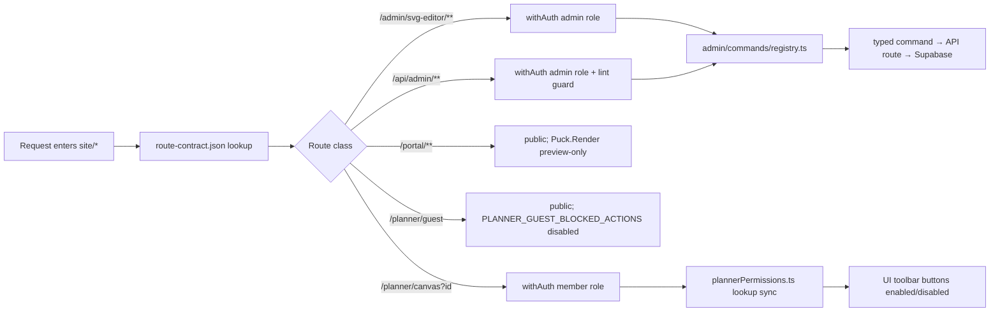

# Phase 07 — Auth & Permissions

Date: 2026-07-04
Status: Planned

## Objective
Enforce auth boundaries across admin / member / guest surfaces without leaking write paths. A single typed permission matrix is source-of-truth for every route handler and toolbar button; admin writes route through one typed command registry (no direct Supabase call from client). Browser storage of auth state is forbidden.

## Inputs to read
- `D:\new\plannnerplan\IMPLEMENTATION-DECISIONS.md` — route map (admin gated, portal public, planner member)
- `D:\new\plannnerplan\QUALITY-GATES.md` — authorization matrix, lint guards, snapshot integrity
- `D:\new\plannnerplan\FAILURESPLAN.md` — Phase 07 ownership (auth), deferred Matrix UX dependencies
- `D:\new\plannnerplan\phases\02-catalog-source-of-truth-and-blockdescriptor.md` — error taxonomy that maps `.invalid → 422`
- `D:\new\plannnerplan\phases\04-admin-portal-svg-editor.md` — admin-side consumption
- `D:\new\plannnerplan\phases\05-portal-public-render.md` — public surface
- `D:\new\plannnerplan\phases\06-planner-inventory-and-symbol-consumer.md` — member-side consumption

## Scope
In scope: `features/planner/model/plannerPermissions.ts` matrix, `withAuth` middleware widening, `/planner/guest` blocked toolbar actions, `/planner/canvas?id=<uuid>` member gate, `/portal/*` public profile, route-contract.json auth gates, typed command registry `admin/commands/registry.ts` (no direct Supabase from client), 422 mapping for `Open3dDescriptorError.invalid`, 409 save-conflict variant, cross-matrix tests, lint guard against stray auth calls in `/api/admin/`, no-browser-storage rule.
Out of scope: Supabase schema migration (Phase 08), member persistence UX polish (Phase 10 cleanup), guest claim copy/move semantics (open item, requires IMPLEMENTATION-DECISIONS owner approval).

## Architecture

Permission matrix lives at `features/planner/model/plannerPermissions.ts` as a frozen object literal. Lookup is synchronous; results are memoized at module load. Every admin write flows through `admin/commands/registry.ts`; this registry is the only path from client to Supabase.

## Checklist
### Permission matrix (07-AUTH)
- 07-AUTH-01 `plannerPermissions.ts` is the source-of-truth frozen matrix; consumer modules import but never mutate.
- 07-AUTH-02 `PLANNER_GUEST_BLOCKED_ACTIONS` enumeration: `persist | import | export | publish | share`. Each maps to a `<ToolbarButton disabled={true}>` plus a server-side re-check at every write API.
- 07-AUTH-03 `/admin/svg-editor/**` routes require `admin` role via `withAuth(['admin'])` middleware; non-admin redirect (never a partial render).
- 07-AUTH-04 `/api/admin/svg-editor` POSTs require `admin` role. Status mapping mirrors the Phase 04 split: anonymous request (no Supabase session cookie) returns `401`; planner-session-only principal (signed-in but lacks `admin` role) returns `403`. The two statuses are not collapsed.
- 07-AUTH-05 `/portal/**` is public; `<Puck.Render>` is mounted in preview mode with edit affordances server-stripped (Phase 05 enforces).
- 07-AUTH-06 `/planner/canvas?id=<uuid>` requires `member` session; without id, default session binds if a recent member session exists.
- 07-AUTH-07 `/planner/guest` is public; toolbar buttons matching `PLANNER_GUEST_BLOCKED_ACTIONS` are visually disabled AND server-side re-checked on the only allowed write path (currently `none` → return 403 on any future read/write attempt).
- 07-AUTH-08 `site/config/route-contract.json` reflects auth gates for `/admin/**`, `/api/admin/**`, `/portal/**`, `/planner/canvas`, `/planner/guest`. Smoke tests parse this file (Phase 06 dependency).
- 07-AUTH-09 `Open3dDescriptorError.invalid → 422` mapping is additive vs the seven planner-persistence categories; the mapper preserves `code` field unchanged (compatibility with Phase 02 + Phase 04 API).
- 07-AUTH-10 Save-conflict (a write losing to a concurrent write on the same descriptor) surfaces an HTTP `409.save_conflict` variant carrying a probe token. The probe token is reserved for `409.save_conflict` ONLY; Phase 02's `409.hash_mismatch` and Phase 08's `409.lock_busy` deliberately do NOT carry a probe token (they carry the same `409.status` but distinct code suffixes and uniquely-marked retry semantics).
- 07-AUTH-11 All admin writes go through `admin/commands/registry.ts`; lint rule denies `import('@/lib/supabase/server')` (or equivalent) from any client-side bundle under `/admin/**`.

### Tests (07-TEST)
- 07-TEST-01 Cross-matrix authorization test: `admin × member × guest × anonymous` against every restricted route returns the expected status (`200 | 403 | 401`).
- 07-TEST-01b — cross-matrix 409 sticky-code assertion: combined test asserts `409.hash_mismatch` (Phase 02 reader-side), `409.lock_busy` (Phase 08 writer-side lock), and `409.save_conflict` (Phase 07 writer-side save-conflict) coexist on their respective paths under a single test invocation; bare 409 collapses never pass; each sticky code must remain distinct in test output.
- 07-TEST-02 `withAuth` middleware lint guard: removing `withAuth` from a `/api/admin/**` route handler fails CI with a precise error.
- 07-TEST-03 Permission lookup performance: lookup is synchronous and `p95 < 1 ms` for any role × any action (micro-benchmark test).
- 07-TEST-04 Client-side API keys: a regex scan over `/api/admin/**` route handlers using `regex(/SUPABASE.*SERVICE.*(ROLE|KEY|SECRET)|SERVICE_ROLE_KEY|service_role/i)` fails on any match outside the dedicated server-only module. Pattern follows Adobe/Supabase service-role conventions; the gate is the regex, not a single envvar name.
- 07-TEST-05 Save-conflict probe token round-trip: 409 response carries a probe token; resubmission with the probe token returns `200` (or appropriate variant).
- 07-TEST-06 Browser storage lint guard: scanning client bundles for `localStorage` writes containing `auth` or `session` keys fails CI.

## Exit gate
- Permission matrix file present, fully typed; lookup test green.
- `withAuth(['admin'])` on every `/api/admin/svg-editor/**` route; lint guard active and blocks drift.
- `/portal/**` runs green in production-style mock auth; non-admin role redirected to login from `/admin/svg-editor/**`.
- Member session opens `/planner/canvas?id=<uuid>`; guest role stays on `/planner/guest` with blocked-action buttons disabled.
- 422 + 409 variants demonstrably distinct in test output.
- Single typed command registry introduced; no direct Supabase client call from any client bundle.
- Lint guard scans forbid browser-storage auth keys and stray service-role keys.
- Status flow: `Planned → Implemented` after matrix + middleware + lint guards green; `Verified in staging` after cross-matrix tests pass; `Promoted` after Phase 04 admin route halts non-admin roles; `Accepted` after Phase 06 planner consumer invokes the matrix on every toolbar render.

## Phase governance
### Forbidden actions
- Do NOT duplicate permission lists in route handlers — rely on `plannerPermissions.ts`.
- Do NOT put auth state in browser storage (localStorage / sessionStorage / cookies written from client JS).
- Do NOT embed service-role credentials in any `/api/admin/**` handler outside the dedicated server-only module.
- Do NOT mount `/admin/svg-editor/**` without `withAuth(['admin'])` — gate is mandatory, even for staff smoke tests.
- Do NOT extend `PLANNER_GUEST_BLOCKED_ACTIONS` silently — list lives in matrix file, change via PR review.

### Phase entry checklist
- Existing `withAuth(['admin'])` middleware exists and is tested in Phase 04.
- `Open3dDescriptorError` taxonomy stable (Phase 02).
- `route-contract.json` schema stable; Phase 06 readers parse it.
- Browser-storage lint rule infrastructure (custom ESLint rule or grep-based) in place or scheduled.

### Rollback criteria
- Cross-matrix test fails for any admin route (`200` instead of `403`) → abort; gate is wrong, must fix before further steps.
- Service-role key detected outside the dedicated server module → abort; rotate the key, audit.
- Browser-storage auth write detected in client bundle → abort; remove and re-run.

### Risk register
- Risk: middleware ordering silently skipping auth. Mitigation: route contract parser asserts middleware presence per route class.
- Risk: 422 → 409 collision surface area confusing. Mitigation: distinct error variant names; integration test asserts unique codes.
- Risk: Permission lookup drift between planner UI and server. Mitigation: single matrix file imported by both; lint rule enforces single source.

### Success metrics
- Permission lookup p95 < 1 ms.
- Cross-matrix test suite green for full role × route XOR.
- Lint guard fires on first attempt at forbidden pattern.
- No new `process.env.*` literal leaks past CI scan.

### Dependencies
- Phase 02 error taxonomy.
- Phase 04 `/api/admin/svg-editor` consumers.
- Phase 05 `/portal/**` public surface.
- Phase 06 `/planner/canvas?id=` member gate.

### Performance budgets
- Permission lookup p95 < 1 ms.
- `withAuth` middleware response time p95 ≤ 80 ms (Phase 04 derived).
- `route-contract.json` parse ≤ 5 ms at route resolution.

### Security considerations
- All admin writes through typed command registry; client never imports Supabase service-role module.
- Session state lives server-side; cookies are HTTP-only, `SameSite=Lax`, `Secure` (set by host platform).
- 422 + 409 carry no internal stack trace text; only `code` and machine-readable field paths.
- Per-directory R2 credentials remain scoped (Phase 04 ownership).

### Accessibility considerations
- Disabled toolbar buttons are not visually-hidden — they keep their label and tag so screen-reader users see what is gated.
- Login redirect destinations carry the original path so users land back where they attempted.
- Live-region announces "permission denied" to assistive tech with a discreet `aria-live="polite"` notice.

### Decision log
- 2026-07-04 — Decision: permission matrix lives at `features/planner/model/plannerPermissions.ts`, frozen object literal. Reason: single source-of-truth import path shared by UI and server; immutability enforced at module-load. Alternatives: per-route handlers each declaring their own list — rejected (drift). Owner: Identity agent.
- 2026-07-04 — Decision: typed command registry is the only path from client to Supabase. Reason: defense-in-depth against future contributors bypassing auth by reaching into Supabase directly. Alternatives: rely on the lint guard alone — rejected (insufficient). Owner: Identity agent.
- 2026-07-04 — Decision: no browser-storage auth state. Reason: server-side session means client compromise cannot replay auth. Alternatives: cookie-based session — rejected as less controllable. Owner: Identity agent.
- 2026-07-04 — Decision: 422 + 409 carry distinct machine codes; mapper preserves `code` field. Reason: client retry semantics differ (422 is unparseable payload; 409 is conflict with a probe token). Alternatives: collapse to 400 — rejected (loss of semantic). Owner: Identity agent.
- 2026-07-04 — Decision: 401 (anonymous) vs 403 (planner-session) split on `/api/admin/**` mirrors Phase 04 §04-TEST-01. Reason: Phase 06 cross-matrix test asserts a 2-status XOR and a 1-status mapping would force the test to invent the gap. Alternatives: collapse both to 403 — rejected for hiding anonymous-vs-authenticated distinction. Owner: Identity agent.
