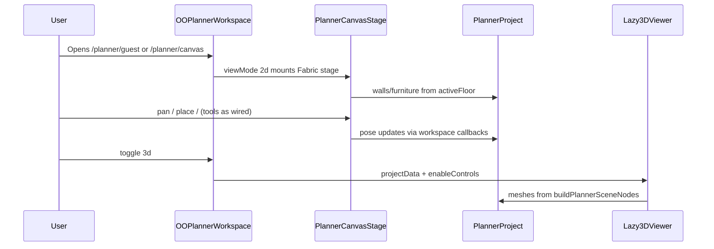
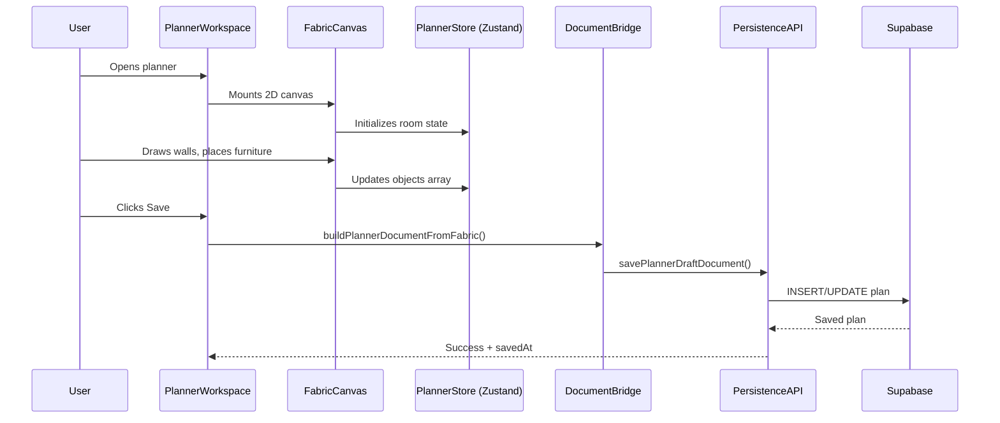
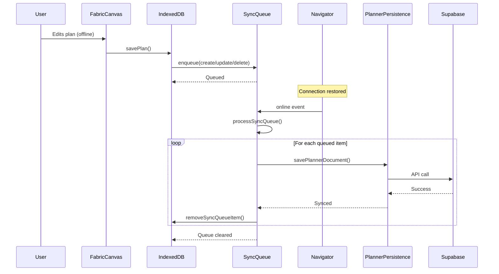
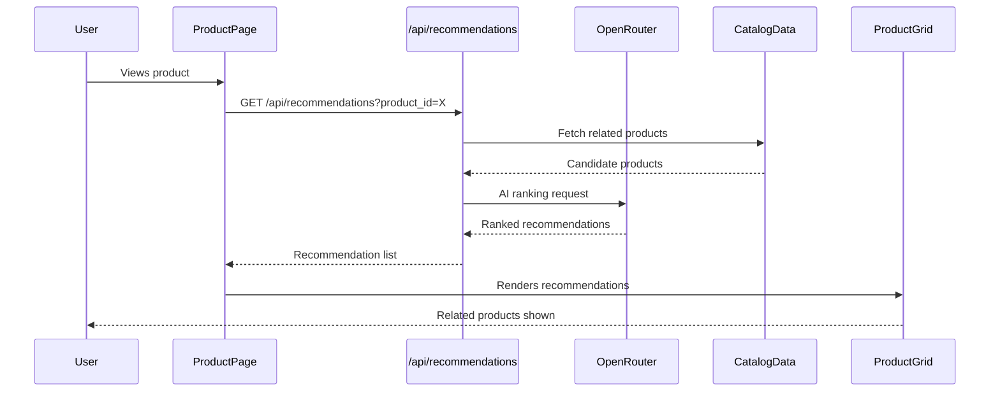
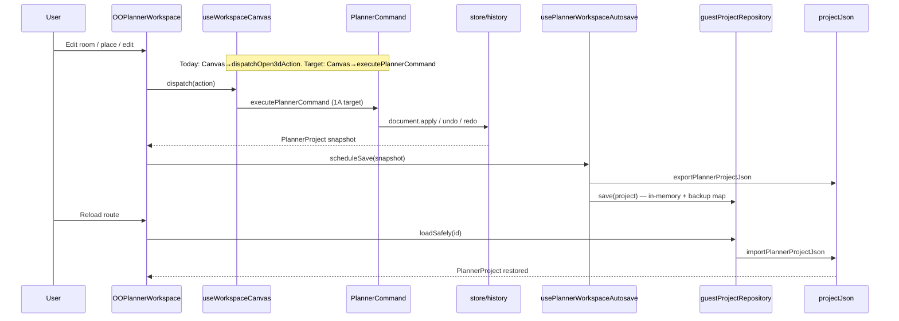
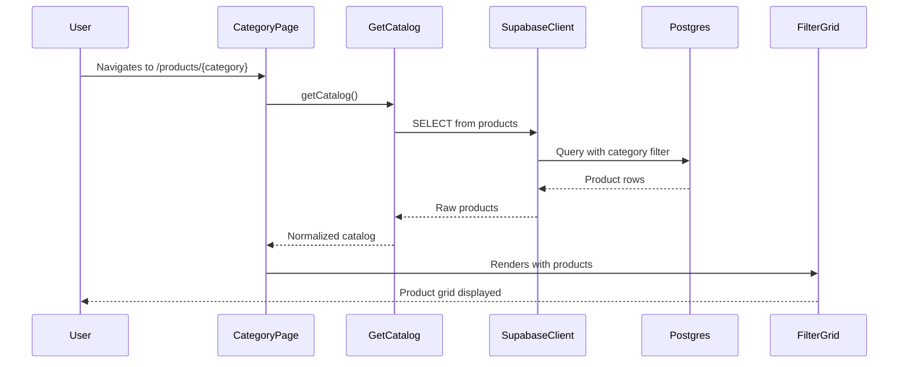
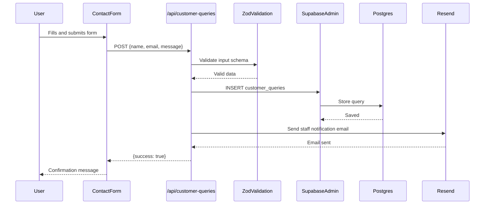
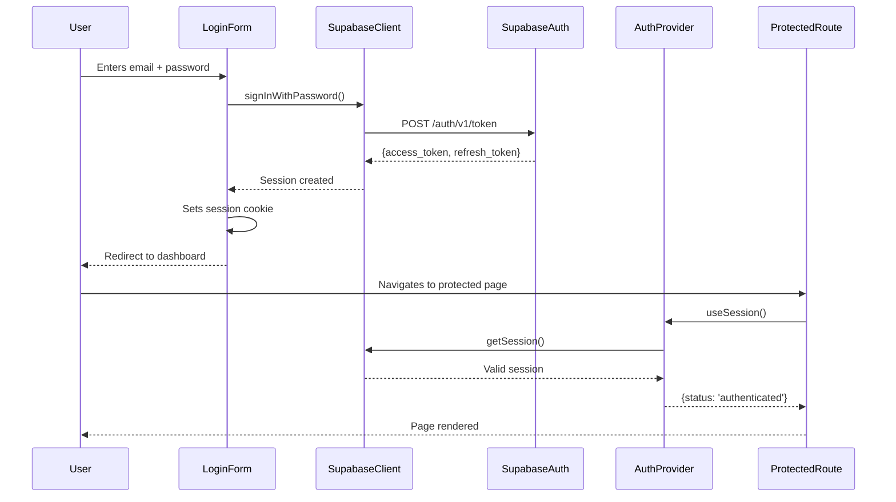
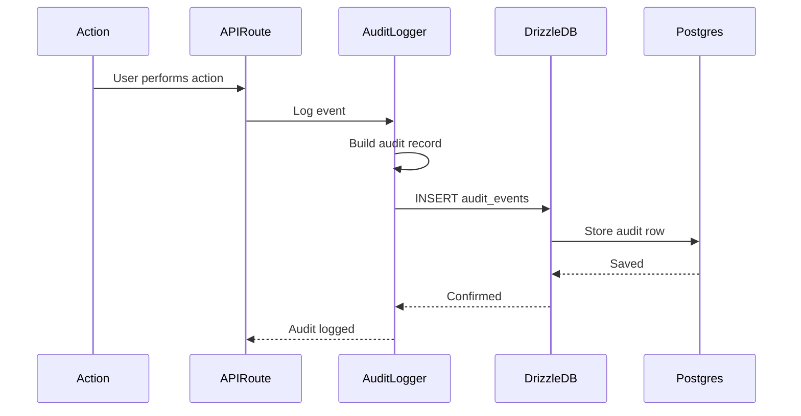

# Data Flow Diagrams

**Status:** Live reference — verify against code before gate claims  
**Authority:** [`plan/QUALITY-BAR.md`](../../plan/QUALITY-BAR.md) → **this file**  
**Index:** [`README.md`](README.md) · [`docs/Lockedfiles/INDEX.md`](../Lockedfiles/INDEX.md)  
**Placement:** [`01-MODULE-LAYOUT.md`](01-MODULE-LAYOUT.md) · [`02-DOMAINS.md`](02-DOMAINS.md)  
**Locked overlay:** [`01-planner-current.md`](../Lockedfiles/01-planner-current.md) · [`03-dependencies-engines-current.md`](../Lockedfiles/03-dependencies-engines-current.md)

**Upgrade lock:** Live 2D = Fabric `PlannerCanvasStage` (`data-testid="planner-fabric-stage"`). Feasibility / `canvas-feasibility` **does not and will not exist** (not live, not archive).

| Sections | Scope |
|----------|-------|
| **§0** | Live planner 2D + 3D (Fabric stage) — **use this** |
| **§1–4** | Legacy archive Fabric shell diagrams — historical only |
| **§5** | Live save/reload |
| **§6** | SVG block publish (Admin — not plan-draw) |
| **Appendix** | Platform flows (auth, catalog, audit, offline) |

---

## §0. Live plan edit (Fabric stage)

Guest / canvas hosts mount the same live workspace. 2D is **not** Feasibility and **not** an archive Fabric shell. `/planner/open3d` is **301 only**.



| Piece | Path |
|-------|------|
| Workspace | `features/planner/editor/OOPlannerWorkspace.tsx` |
| 2D entry | `project/canvas-stage` → `features/planner/canvas` |
| Document | `project/model/` |
| 3D | `features/planner/3d/` + `getPlannerViewerControlProps()` |
| Persist | P06 — IDB first; honest local/cloud labels |

Raise select / Block2D / wall-draw **on Fabric** — see Planner P03/P05/P07. Do not invent or restore Feasibility / `canvas-feasibility` to “make diagrams match.”

---

## §1. Plan creation (legacy archive Fabric path)

**Historical only** (`_archive/fabric`). Not the live interactive host. Kept so old traces still parse.



---

## §2. Offline-first sync (legacy planner)



---

## §3. Planner persistence — 3-layer stack (legacy/current guest)

> Authority for guest/canvas paths. Open3d pilot uses §5.

### Layer 1 — Autosave (IndexedDB)

**File:** `features/planner/persistence/persistence.ts`

```text
Fabric canvas (live session)
  └─► exportDraft() → serialized Fabric JSON
        └─► usePlannerFabricAutosave.schedulePersist()
              └─► buildSessionEnvelope(store) → PlannerSessionEnvelope
                    └─► createAutoSaver(projectId).scheduleSave(snapshot)
                          ├─► saveProject()      → IndexedDB "projects"
                          └─► saveHistoryEntry() → IndexedDB "history"
```

| Constant | Value |
|----------|-------|
| DB name | `planner-workspace-db` (version 1) |
| Guest project ID | `planner-guest-local` |
| Member project ID | `planner-member-local` (or `:planId`) |
| Autosave debounce | 5 000 ms |
| History cap | 10 entries per project |

### Layer 2 — Named drafts (localStorage, TTL 24 h)

**File:** `features/planner/persistence/plannerDraft.ts`

```text
buildCurrentPlannerDocument() → PlannerDocument
  └─► savePlannerDraftDocument(doc, scope)
        key:  cad-suite:planner:draft:v1:user:{uid}:doc:{docId}
        envelope: { schemaVersion: 1, savedAt, expiresAt, document }
        TTL: 24 hours (PLANNER_DRAFT_TTL_MS = 86_400_000 ms)
```

### Layer 3 — Cloud sessions (Supabase)

**Files:** `plannerSaves.ts`, `plannerCloudApi.ts`

| API | Method | Used by |
|-----|--------|---------|
| `/api/plans` | GET | `listOwnerPlansFromApi()` |
| `/api/plans/{id}` | GET | `loadPlanFromApi(id)` |
| `/api/plans/{id}` | PUT | `savePlanToApi(doc)` |
| `/api/plans/{id}` | DELETE | `deletePlanFromApi(id)` |
| `/api/admin/plans?limit=100` | GET | `listAdminPlansFromApi()` |

### Guest-to-member migration

```text
migrateGuestProjectToMember()
  └─► shouldMigrateGuestPlan(guest, member, alreadyClaimed)
        ┌────────────────────────────────────────┬──────────────┐
        │ Condition                              │ Result       │
        ├────────────────────────────────────────┼──────────────┤
        │ alreadyClaimed = true                  │ "skipped"    │
        │ guest.snapshot empty/missing           │ "no-guest-data"│
        │ member.snapshot non-empty              │ "skipped"    │
        │ guest data + empty member slot         │ migrate ✅   │
        └────────────────────────────────────────┴──────────────┘
```

### Data-loss invariants (assert in every test)

1. Validation completes **before** live state replacement.
2. Failed persistence never shows `Saved`.
3. Guest claim never overwrites a non-empty member snapshot.
4. Delete affects only the selected session (local or cloud).
5. Import/export round-trip preserves all normalized canonical fields.
6. Draft TTL (24 h) removes only the expired draft.

---

## §4. Recommendation engine (legacy site flow)



---

## §5. Live workspace — save / reload (1A target)

**Routes:** `/planner/guest` · `/planner/canvas` (`app/planner/(workspace)/…`)  
**Code:** `features/planner/project/persistence/` · shell `features/planner/editor/`

### On disk today vs 1A target

| Piece | Today | 1A target |
|-------|-------|-----------|
| Document mutations | `useWorkspaceCanvas` → **`dispatchOpen3dAction` directly** | `executePlannerCommand` for all mutations |
| Autosave | `usePlannerWorkspaceAutosave` → `guestProjectRepository` | Same — already wired |
| Tests | `plannerCommandWiring.test.ts` **red** until seam wired | Green with boundary tests |



| Piece | Path |
|-------|------|
| Command seam | `lib/commands/plannerCommand.ts` |
| Canvas hook (bypass today) | `editor/useWorkspaceCanvas.ts` |
| Autosave hook | `persistence/usePlannerWorkspaceAutosave.ts` |
| Guest repo | `persistence/guestProjectRepository.ts` |
| Serialize | `persistence/projectJson.ts` |

**1A acceptance:** room → opening → place → edit → undo/redo → save → reload on `/planner/guest` or `/planner/canvas`.

**Tests:** `plannerCommandWiring.test.ts`, `plannerCommandBoundary.test.ts`, `tests/e2e/open3d-workspace.spec.ts`.

**Expert:** No — verify with unit + E2E evidence under `results/`.

---

## §6. SVG block publish — admin → catalog artifact

**Authority:** Option A — no SVG.js in production path (`docs/Lockedfiles/03-dependencies-engines-current.md`)

### On disk today vs A4 target

| Piece | Today | A4 target |
|-------|-------|-----------|
| Admin edit | Schema-driven no-code form + debounced server compile preview | A4 templates, history, drafts, validation, a11y |
| Publish | Server action and compatibility API call `publishDescriptorWithPipeline`; compile failure blocks persist | Draft recovery remains distinct from publish |
| Compile | `compileSvgForPublish` → `runSvgCompileStages` → pipelineCore; then `runSvgPipeline({skipCompile:true})` writes S4 | Add measured preview/publish latency |
| Reference compiler | `svgCompiler.server.ts` is not publish authority | Remove or clearly quarantine after schema migration |
| Consumer | `BlockDescriptor` loader in open3d catalog | Bridge from `SvgBlockDefinitionV1` |

```mermaid
sequenceDiagram
    participant Admin as AdminSvgEditor
    participant Form as No-code form
    participant Publish as publishDescriptorWithPipeline
    participant Compiler as compileSvgForPublish
    participant Writer as runSvgPipeline S4
    participant Disk as block-descriptors/
    participant Loader as svgBlockDescriptorLoader
    participant Catalog as open3d catalog

    Note over Admin,Form: Explicit controls; no JSON or code required
    Admin->>Form: Edit fields
    Form->>Publish: Server-action publish
    Publish->>Compiler: BlockDescriptor input
    alt compile fail
        Publish-->>Admin: failure — no descriptor persist
    else success
        Compiler->>Writer: sanitized SVG
        Writer->>Disk: public/svg-catalog/{slug}.svg
        Publish->>Disk: atomic descriptor persist
        Disk-->>Loader: read on next catalog hydrate
        Loader-->>Catalog: BlockDescriptor consumer
    end
```

| Boundary | Rule |
|----------|------|
| Browser | No `sharp`, `svgo`, `resvg`, server compiler imports |
| Publish | Publish ≠ save; compile failure blocks publish |
| Dual models | `SvgBlockDefinitionV1` (admin/compiler) → bridge → `BlockDescriptor` (loader) |
| Compile authority | Publish uses `compileSvgForPublish`; CLI parity still needs a maintained regression gate |
| Revisions | Supabase immutable table — Phase 08; disk JSON OK for 1B |

**Expert: Yes (1B)** — security + determinism sequence before publish sign-off.

**Tests:** `svgPackageBoundaries.test.ts`, `svgPhase1Completion.test.ts`, API route tests.

**Admin UI:** [Admin](../../plan/Admin/CHECKLIST.md).

---

## Appendix A. Product catalog query



---

## Appendix B. Customer query submission



---

## Appendix C. Authentication



---

## Appendix D. Audit logging



---

## Data validation layers

1. **Client-side**: React form validation, Zod schemas in components
2. **API boundary**: Zod schema validation in route handlers
3. **Database**: PostgreSQL constraints, Drizzle schema types
4. **Supabase RLS**: Row-level security policies

## Error handling patterns

- **API routes**: Try/catch with standardized error responses
- **Supabase queries**: `fetchWithSupabaseRetry` with exponential backoff
- **Canvas operations**: Error boundaries around Fabric/Three.js components
- **Offline sync**: Retry queue with max 3 attempts, conflict detection

---

## References

- [`02-DOMAINS.md`](02-DOMAINS.md) — domain surfaces
- [`01-MODULE-LAYOUT.md`](01-MODULE-LAYOUT.md) — where code lives
- `testing-handbook.md` — gate policy
