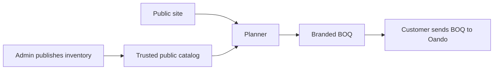
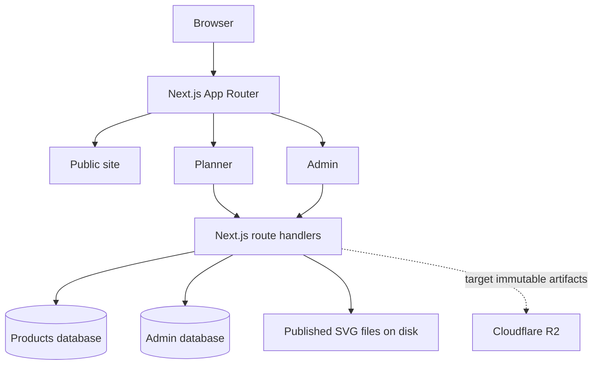
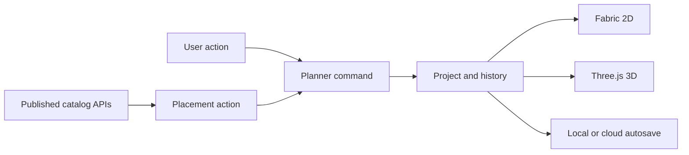

# Runtime architecture

This document describes the live repository on 2026-07-17.
Target-state differences are stated explicitly.
Code wins when this document and the implementation differ.

## Workspace boundaries

| Boundary | Responsibility | Runtime |
|---|---|---|
| Repository root | pnpm orchestration, release gates, generated output | Build and CI only |
| `site/` | Public site, Planner, Admin, API routes | Next.js on Vercel and localhost |
| `tech-docs-generator/` | Repository inventory and technical docs UI | Vite build and local docs server |
| `generated-documents/` | Generated JSON, Markdown, and static docs site | Build output only |

All installs run from the repository root.
The workspace package manager is pnpm.

## Product flow

The catalog and BOQ are product boundaries.
The canvas is not an isolated demo.

## Site runtime

`site/app/` owns routing and API entrypoints.
Route files stay thin.
Domain behavior lives under `site/features/`.
Shared infrastructure lives under `site/lib/` and `site/platform/`.

## Planner runtime

The Planner opens on a blank project when no saved draft exists.
A template is created only after an explicit template action.

`OOPlannerWorkspace` coordinates the surface.
`useWorkspaceCanvas` owns the project and command history.
`PlannerCanvasStage` renders and edits the 2D Fabric scene.
The Three.js viewer projects the same project model into 3D.
Dockview owns draggable and resizable panel layout.
Persisted Dockview state uses a validated schema.

Guest Planner access is public.
Guest drafts are local.
Protected plan APIs require authenticated access where configured.

## Catalog and SVG authority

Marketing products and managed Planner products use the Products database.
Released SVG authoring is still disk-authoritative.
Live SVG descriptors are under `site/inventory/descriptors/`.
Live SVG bytes are under `site/public/svg-catalog/`.
The public SVG catalog now excludes entries without a valid published SVG artifact.

Products database plus immutable R2 artifacts is the target authority.
That cutover is incomplete.
See [08-DATABASE-SVG-CONTRACT.md](08-DATABASE-SVG-CONTRACT.md).
Active release blockers remain in [Failures.md](../../Failures.md).

## Security boundaries

Secrets stay in `.env.local` or deployment secret storage.
They never cross into public client variables unless explicitly safe.

Protected route handlers use the shared auth wrapper.
Mutating cookie-authenticated routes opt into double-submit CSRF protection.
The browser API client bootstraps a CSRF token before its first mutation.
It retries only responses explicitly marked as CSRF rejections.

Public APIs remain rate limited.
Database authorization remains server-side.
Admin publication remains a privileged server operation.

## Styling and accessibility

The shared CSS tree is `site/app/css/`.
Semantic tokens are defined in the core theme.
Planner surface CSS lives in `site/app/css/core/locked/planner/`.
Isolated Planner CSS modules are allowed by the repository contract.

React Aria owns keyboard and focus behavior for Planner controls.
Dockview owns docking behavior.
CSS must not fake unavailable tools or states.

## Build and deployment

Vercel builds the `site/` package.
Root scripts orchestrate checks with pnpm.
The production gate includes type, lint, tests, build, layout, and release checks.
Local browser acceptance runs against localhost.

The tech-docs generator reads repository facts and writes only to `generated-documents/`.
Files in `docs/architecture/` are auto-indexed after `pnpm run tech-docs:generate`.
Their full Markdown body is not copied into the SPA.
The Architecture page shows the generated source index and live repository facts.

## Direct dependency policy

A direct runtime dependency must have a live import or a documented build-time role.
Benchmark-only packages do not belong in `site/package.json`.
Transitive dependencies remain owned by the package that imports them.

The 2026-07-17 audit removed unused site declarations for:

- `@flatten-js/core`
- `@axe-core/react`
- `@gltf-transform/extensions`
- `@google/generative-ai`
- `@gsap/react`
- `embla-carousel-autoplay`
- `file-saver`
- `lenis`
- `papaparse`
- `pdfjs-dist`
- `react-router-dom`
- `recharts`
- `sonner`
- `zundo`

`react-router-dom` remains in `tech-docs-generator/package.json` because that SPA imports it.
