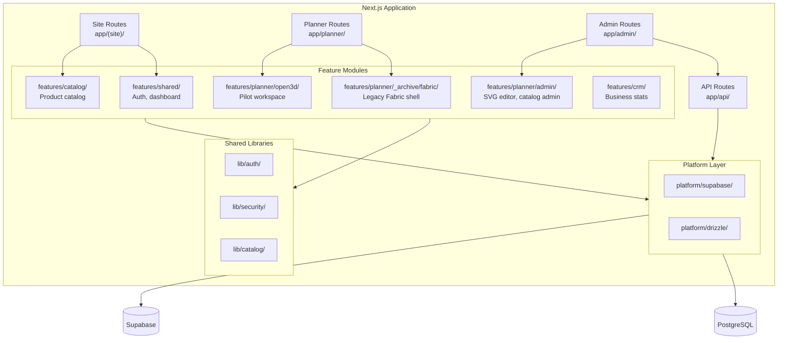

# Component Architecture

**Status:** Live map (refresh after 1A/1B acceptance)  
**Authority:** `plann/REVISION-2026-07-05.md` → [`MODULE-LAYOUT.md`](MODULE-LAYOUT.md) → **this file**  
**Index:** [`README.md`](README.md) · [`docs/Lockedfiles/INDEX.md`](../Lockedfiles/INDEX.md)  
**Locked baseline:** [`docs/Lockedfiles/architecture/current.md`](../Lockedfiles/architecture/current.md) · [`proposed.md`](../Lockedfiles/architecture/proposed.md)

---

## C4 Container Diagram

---

## Current (on disk today)

### Planner — dual reality

| Route | Entry | Stack |
|-------|-------|-------|
| `/planner/open3d` | `app/planner/open3d/page.tsx` → `Open3dPlannerHost` | **Phase 1A pilot** — sole promotion target |
| `/planner/guest`, `/planner/canvas` | `app/planner/(workspace)/*` → `Open3dPlannerHost` | Deployable hybrid; Phase 2 promotion decision |
| `/planner/fabric/*` | Archive fallback | `_archive/fabric/` |

**Production source tree:** `site/features/planner/open3d/` (per `AGENTS.md` — not `OOPlanner/` or `open3d-next-staging/`)

#### Open3d module tree (canonical)

| Subfolder | Role |
|-----------|------|
| `editor/` | Workspace chrome — `OOPlannerWorkspace`, panels, `useWorkspaceCanvas`, `*.module.css` |
| `ui/` | `Open3dNativeHost` — route host adapters |
| `canvas-fabric/` | 2D Fabric canvas (embedded in hybrid) |
| `3d/` | Three.js / r3f lazy viewer |
| `model/` | `Open3dProject`, actions, invariants |
| `store/` | History (zundo), selection, workspace preferences |
| `lib/commands/` | `PlannerCommand` + `executePlannerCommand` |
| `persistence/` | `guestProjectRepository`, `projectJson`, autosave |
| `catalog/` | Workspace catalog, SVG block loader (consumer) |
| `shared/` | Export/import, document bridge |
| `ai/` | Advisor, sketch-to-plan |

**Host chain:** `Open3dPlannerHost` (`features/planner/ui/` shim) → `ui/Open3dNativeHost` → `editor/OOPlannerWorkspace` → canvas or 3D viewer.

**Command seam (honest):** `executePlannerCommand` exists and is tested in unit tests, but **`useWorkspaceCanvas` still dispatches via `dispatchOpen3dAction` directly** — 1A P0 is to route document mutations through the command layer. `plannerCommandWiring.test.ts` is red until wired.

### Planner — legacy (frozen)

| Path | Status |
|------|--------|
| `features/planner/editor/` (root) | **Frozen** — no new files |
| `features/planner/store/`, `model/` (root) | **Frozen** — migrate to `open3d/` |
| `features/planner/_archive/fabric/` | Legacy Fabric shell — vitest aliases here |

Do not extend root `features/planner/editor/` for Phase 1. See [`MODULE-LAYOUT.md`](MODULE-LAYOUT.md).

### Admin

| Area | Path |
|------|------|
| Routes | `app/admin/**` — `[id]` hosts `<Render>` preview today |
| SVG pipeline UI | `features/planner/admin/svg-editor/` |
| Catalog admin views | `features/planner/admin/*` |

**On disk:** `puckBlockRegistry.tsx` defines Puck config; edit view is JSON + field rows; **`app/admin/svg-editor/[id]/page.tsx` mounts `<Render>` only** — not full `<Puck onPublish=…>`. Full mount is **1B**.

**Compile (honest):** publish API uses `svgPipelineRunner` (exec `generate-svg.mjs`); in-process `svgCompiler.server.ts` exists for tests — **dual path open** until 1B unifies.

Contracts: Zod descriptors, `puckBlockRegistry`, server compilers (`svgCompiler.server.ts`, `svgArtifactCompiler.server.ts`). No SVG.js in Phase 1 (Option A).

### Marketing

| Area | Path |
|------|------|
| Homepage sections | `components/home/` |
| Site chrome | `components/site/` |
| Planner landing | `features/planner/landing/` |

UI contract deferred to UI-3 — [`SITE-MARKETING-UI-CONTRACT.md`](SITE-MARKETING-UI-CONTRACT.md).

### Catalog, shared, platform

| Module | Path | Role |
|--------|------|------|
| Catalog | `features/catalog/` | Categories, images, `getProducts.ts` |
| Shared | `features/shared/` | Auth, dashboard, analytics |
| Supabase | `platform/supabase/` | Browser + server clients, auth-admin |
| Drizzle | `platform/drizzle/` | Profiles, plans, teams, audit_events |

---

## Proposed (Phase 1 target)

Per `plann/REVISION-2026-07-05.md`:

| Change | Target |
|--------|--------|
| **1A** | `/planner/open3d` pilot accepted — `PlannerCommand` wired in `useWorkspaceCanvas`, selection, save/reload, Phosphor chrome |
| **1B** | Admin full `<Puck>` publish → unified compile → disk descriptors → open3d catalog loader (Option A, no SVG.js) |
| **Phase 2** | Guest/canvas promotion decision — not before 1A+1B |
| **UI** | Layer → surface → module; [`MODULE-UI-CONTRACT.md`](MODULE-UI-CONTRACT.md) on every new editor module |
| **Fabric** | Stays in hybrid until explicit promotion; no second canvas engine |
| **Hosts** | `Open3dPlannerHost` re-export from `open3d/ui/`; thin `app/planner/open3d/` only |

**Expert review:** Optional after 1A for C4 security boundaries (client vs server-only SVG).

---

## API Layer (selected)

| Group | Purpose |
|-------|---------|
| `app/api/plans/` | Plan CRUD |
| `app/api/admin/catalog/` | Catalog management |
| `app/api/admin/svg-editor/` | Block descriptor compile/persist (1B) |
| `app/api/admin/themes/` | Theme tokens publish |
| `app/api/customer-queries/` | Inquiries |
| `app/api/ai-advisor/` | Layout assistance |

---

## Related docs

- [`MODULE-LAYOUT.md`](MODULE-LAYOUT.md) — placement rules
- [`DATA_FLOW.md`](DATA_FLOW.md) — §5 open3d save, §6 SVG publish
- [`MODULE-UI-CONTRACT.md`](MODULE-UI-CONTRACT.md)
- [`ADMIN-UI-CONTRACT.md`](ADMIN-UI-CONTRACT.md)
