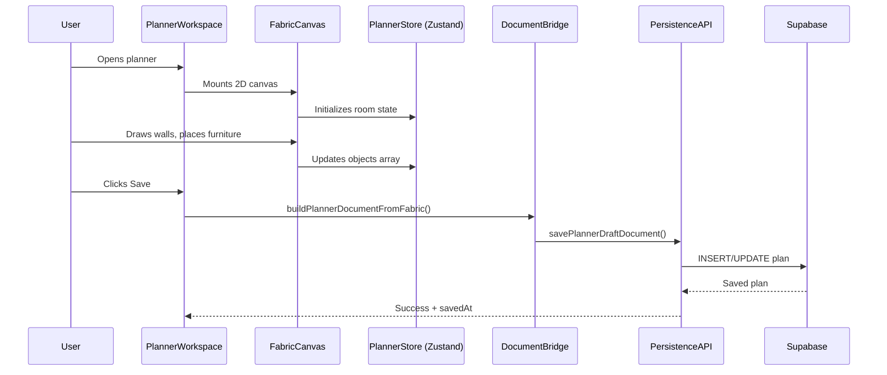
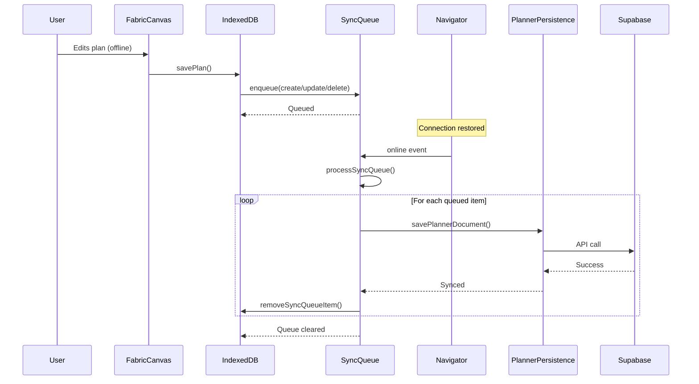
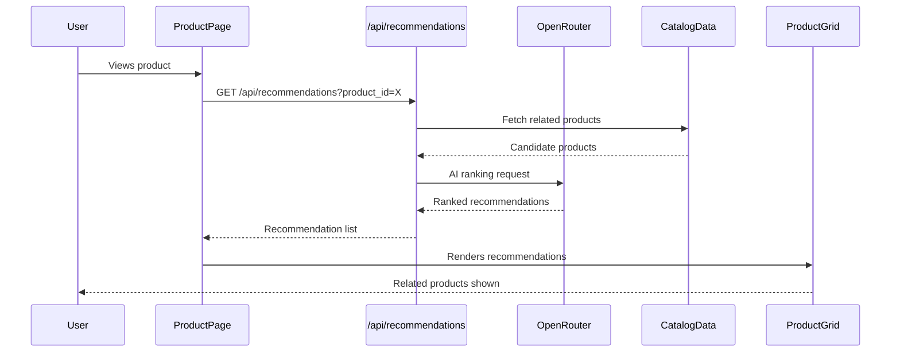
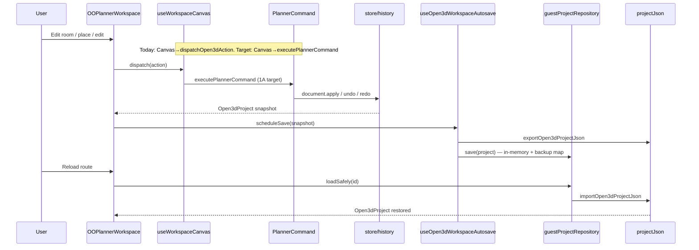
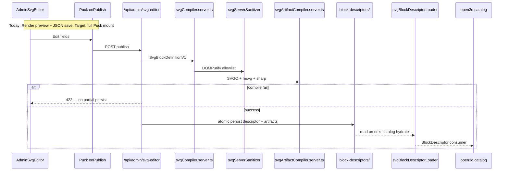
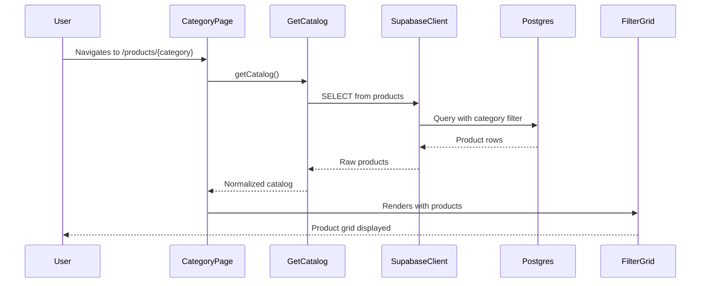
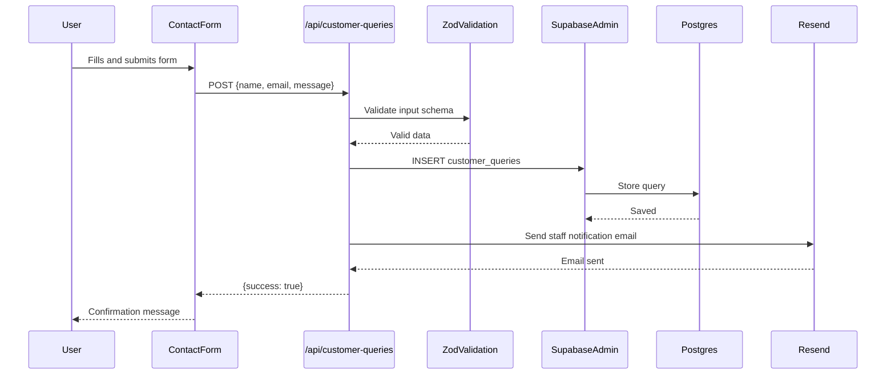
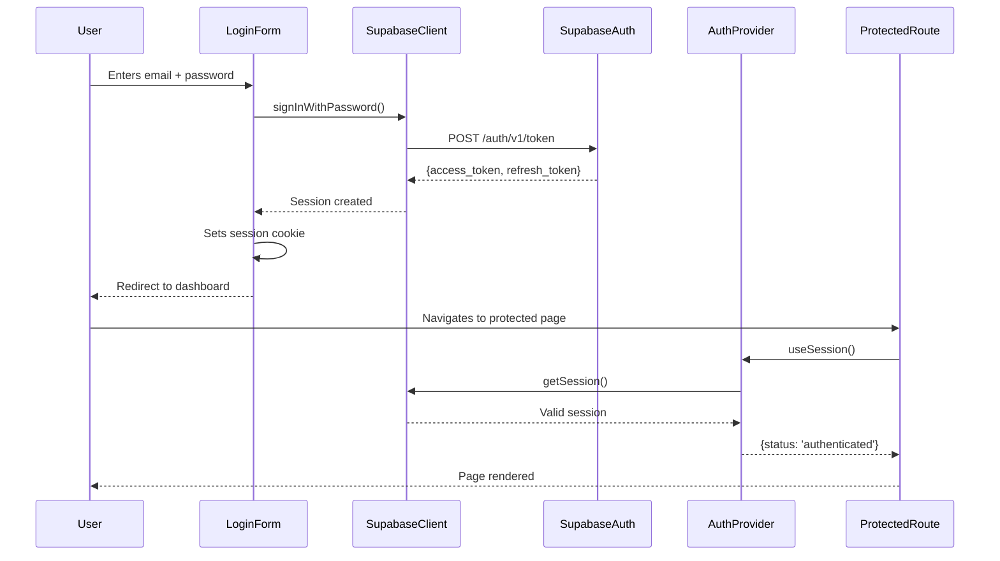
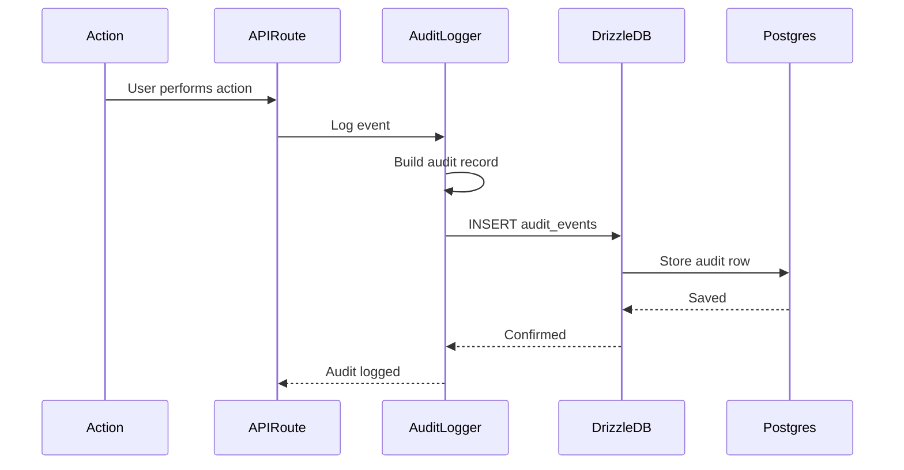

# Data Flow Diagrams

**Status:** Live reference — verify §5–6 against code before 1A/1B sign-off  
**Authority:** `plann/REVISION-2026-07-05.md` → **this file**  
**Index:** [`README.md`](README.md) · [`docs/Lockedfiles/INDEX.md`](../Lockedfiles/INDEX.md)  
**Placement:** [`MODULE-LAYOUT.md`](MODULE-LAYOUT.md) · [`COMPONENT_ARCHITECTURE.md`](COMPONENT_ARCHITECTURE.md)  
**Locked baseline:** [`docs/Lockedfiles/architecture/current.md`](../Lockedfiles/architecture/current.md) · [`proposed.md`](../Lockedfiles/architecture/proposed.md)

| Sections | Scope |
|----------|-------|
| **§1–4** | Legacy / guest / Fabric-era flows (still used on guest/canvas) |
| **§5** | Open3d pilot save/reload — **1A target** (command seam not fully wired) |
| **§6** | SVG block publish — **1B target** (Puck preview only; dual compile open) |
| **Appendix** | Platform flows (auth, catalog, audit, offline stack) |

---

## §1. Plan creation (legacy Fabric path)

Still active on `/planner/guest` and `/planner/canvas`. Not the 1A acceptance target.



---

## §2. Offline-first sync (legacy planner)



---

## §3. Planner persistence — 3-layer stack (legacy/current guest)

> Authority for guest/canvas paths. Open3d pilot uses §5.

### Layer 1 — Autosave (IndexedDB)

**File:** `features/planner/persistence/persistence.ts`

```text
Fabric canvas (live session)
  └─► exportDraft() → serialized Fabric JSON
        └─► usePlannerFabricAutosave.schedulePersist()
              └─► buildSessionEnvelope(store) → PlannerSessionEnvelope
                    └─► createAutoSaver(projectId).scheduleSave(snapshot)
                          ├─► saveProject()      → IndexedDB "projects"
                          └─► saveHistoryEntry() → IndexedDB "history"
```

| Constant | Value |
|----------|-------|
| DB name | `planner-workspace-db` (version 1) |
| Guest project ID | `planner-guest-local` |
| Member project ID | `planner-member-local` (or `:planId`) |
| Autosave debounce | 5 000 ms |
| History cap | 10 entries per project |

### Layer 2 — Named drafts (localStorage, TTL 24 h)

**File:** `features/planner/persistence/plannerDraft.ts`

```text
buildCurrentPlannerDocument() → PlannerDocument
  └─► savePlannerDraftDocument(doc, scope)
        key:  cad-suite:planner:draft:v1:user:{uid}:doc:{docId}
        envelope: { schemaVersion: 1, savedAt, expiresAt, document }
        TTL: 24 hours (PLANNER_DRAFT_TTL_MS = 86_400_000 ms)
```

### Layer 3 — Cloud sessions (Supabase)

**Files:** `plannerSaves.ts`, `plannerCloudApi.ts`

| API | Method | Used by |
|-----|--------|---------|
| `/api/plans` | GET | `listOwnerPlansFromApi()` |
| `/api/plans/{id}` | GET | `loadPlanFromApi(id)` |
| `/api/plans/{id}` | PUT | `savePlanToApi(doc)` |
| `/api/plans/{id}` | DELETE | `deletePlanFromApi(id)` |
| `/api/admin/plans?limit=100` | GET | `listAdminPlansFromApi()` |

### Guest-to-member migration

```text
migrateGuestProjectToMember()
  └─► shouldMigrateGuestPlan(guest, member, alreadyClaimed)
        ┌────────────────────────────────────────┬──────────────┐
        │ Condition                              │ Result       │
        ├────────────────────────────────────────┼──────────────┤
        │ alreadyClaimed = true                  │ "skipped"    │
        │ guest.snapshot empty/missing           │ "no-guest-data"│
        │ member.snapshot non-empty              │ "skipped"    │
        │ guest data + empty member slot         │ migrate ✅   │
        └────────────────────────────────────────┴──────────────┘
```

### Data-loss invariants (assert in every test)

1. Validation completes **before** live state replacement.
2. Failed persistence never shows `Saved`.
3. Guest claim never overwrites a non-empty member snapshot.
4. Delete affects only the selected session (local or cloud).
5. Import/export round-trip preserves all normalized canonical fields.
6. Draft TTL (24 h) removes only the expired draft.

---

## §4. Recommendation engine (legacy site flow)



---

## §5. Open3D pilot — save / reload (1A target)

**Route:** `/planner/open3d` (`app/planner/open3d/page.tsx`) — **real pilot route**  
**Code:** `features/planner/open3d/persistence/`

### On disk today vs 1A target

| Piece | Today | 1A target |
|-------|-------|-----------|
| Document mutations | `useWorkspaceCanvas` → **`dispatchOpen3dAction` directly** | `executePlannerCommand` for all mutations |
| Autosave | `useOpen3dWorkspaceAutosave` → `guestProjectRepository` | Same — already wired |
| Tests | `plannerCommandWiring.test.ts` **red** until seam wired | Green with boundary tests |



| Piece | Path |
|-------|------|
| Command seam | `lib/commands/plannerCommand.ts` |
| Canvas hook (bypass today) | `editor/useWorkspaceCanvas.ts` |
| Autosave hook | `persistence/useOpen3dWorkspaceAutosave.ts` |
| Guest repo | `persistence/guestProjectRepository.ts` |
| Serialize | `persistence/projectJson.ts` |

**1A acceptance:** room → opening → place → edit → undo/redo → save → reload on `/planner/open3d`.

**Tests:** `plannerCommandWiring.test.ts`, `plannerCommandBoundary.test.ts`, `tests/e2e/open3d-workspace.spec.ts`.

**Expert:** No — verify with unit + E2E evidence under `results/`.

---

## §6. SVG block publish — admin → planner catalog (1B target)

**Authority:** Option A — no SVG.js in production path (`plann/REVISION-2026-07-05.md`)

### On disk today vs 1B target

| Piece | Today | 1B target |
|-------|-------|-----------|
| Admin edit | JSON editor + **`<Render>` preview** on `[id]` | Full **`<Puck onPublish=…>`** |
| Publish vs save | Save POST persists; no distinct publish gate | Publish ≠ save; compile fail → 422 |
| Compile path A | API → `svgPipelineRunner` → exec **`generate-svg.mjs`** | Retire as sole authority |
| Compile path B | In-process **`svgCompiler.server.ts`** (tests, artifacts) | **Single module** behind API |
| Consumer | `BlockDescriptor` loader in open3d catalog | Bridge from `SvgBlockDefinitionV1` |



| Boundary | Rule |
|----------|------|
| Browser | No `sharp`, `svgo`, `resvg`, server compiler imports |
| Publish | Publish ≠ save; compile failure blocks publish |
| Dual models | `SvgBlockDefinitionV1` (admin/compiler) → bridge → `BlockDescriptor` (loader) |
| Dual compile | **Unify in 1B** — one module authority; script becomes thin CLI |
| Revisions | Supabase immutable table — Phase 08; disk JSON OK for 1B |

**Expert: Yes (1B)** — security + determinism sequence before publish sign-off.

**Tests:** `svgPackageBoundaries.test.ts`, `svgPhase1Completion.test.ts`, API route tests.

**Admin UI:** [`ADMIN-UI-CONTRACT.md`](ADMIN-UI-CONTRACT.md).

---

## Appendix A. Product catalog query



---

## Appendix B. Customer query submission



---

## Appendix C. Authentication



---

## Appendix D. Audit logging



---

## Data validation layers

1. **Client-side**: React form validation, Zod schemas in components
2. **API boundary**: Zod schema validation in route handlers
3. **Database**: PostgreSQL constraints, Drizzle schema types
4. **Supabase RLS**: Row-level security policies

## Error handling patterns

- **API routes**: Try/catch with standardized error responses
- **Supabase queries**: `fetchWithSupabaseRetry` with exponential backoff
- **Canvas operations**: Error boundaries around Fabric/Three.js components
- **Offline sync**: Retry queue with max 3 attempts, conflict detection

---

## References

- [`COMPONENT_ARCHITECTURE.md`](COMPONENT_ARCHITECTURE.md) — module map
- [`MODULE-LAYOUT.md`](MODULE-LAYOUT.md) — where code lives
- `plann/TEST-PLAN-REVISED-2026-07-05.md` — TEST-1 / TEST-2 gates
