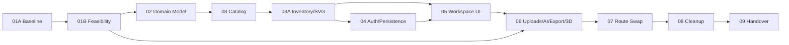

# 00 Start: Execution Control

## Purpose

This is the entrypoint for the Open3D-to-Next.js planner replacement. Read this file before selecting or executing any phase.

## Required reading order

1. `IMPLEMENTATION-DECISIONS.md`
2. `QUALITY-GATES.md`
3. `FAILURESPLAN.md`
4. `DESIGN-BENCHMARK-PROTOCOL.md` for every design-affecting phase
5. `HANDOVER.md`
6. Current numbered phase
7. Earlier phase evidence required by that phase
8. Reference documents only when evaluating or revising product/design decisions

## File roles

### Numbered phase files

These are executable. Work proceeds in order:

1. `01a-baseline-current-planner-and-open3d-source.md`
2. `01b-feasibility-slice-native-open3d-spine.md`
3. `02-domain-model-state-and-document-adapters.md`
4. `03-catalog-admin-and-asset-identity.md`
5. `03a-inventory-system-and-svg-generation.md`
6. `04-guest-member-admin-auth-and-persistence.md`
7. `05-react-workspace-ui-and-canvas-port.md`
8. `06-uploads-ai-export-and-3d.md`
9. `07-route-swap-and-fallback-control.md`
10. `08-cleanup-archive-and-evidence-gates.md`
11. `09-handover-and-next-ownership.md`

Do not begin a dependent phase until its required predecessor status is sufficient under `IMPLEMENTATION-DECISIONS.md`.

### Governing unnumbered files

- `IMPLEMENTATION-DECISIONS.md` defines source of truth, staging promotion, state ownership, migration policy, release slices, viewport tiers, command architecture, and status vocabulary.
- `QUALITY-GATES.md` defines test layers, applicability, thresholds, evidence, security, resilience, and phase acceptance.
- `FAILURESPLAN.md` records plan-specific failures, blockers, skips, incomplete evidence, ownership, and resolution history.
- `DESIGN-BENCHMARK-PROTOCOL.md` requires fresh, current external inspiration research by a dedicated agent before design-affecting execution.
- `HANDOVER.md` is the live cross-folder map and execution status. Update it after every material checkpoint.

These files apply to every phase. If a numbered phase conflicts with them, stop and resolve the contradiction before implementation.

Every numbered phase file also follows the **phase governance template** defined in `IMPLEMENTATION-DECISIONS.md`: forbidden actions, entry checklist, rollback criteria, risk register, success metrics, external dependencies, performance budgets, security, accessibility, and decision log. Traceability IDs (`<phase>-<category>-<nn>`), go/no-go entry criteria, and the phase-completion template are binding from `IMPLEMENTATION-DECISIONS.md`.

### Advisory unnumbered files

- `reference-till-3a/REFERENCE-BENCHMARK-INSPIRATION-AND-GAPS.md`
- `reference-till-3a/REFERENCE-PLAN-REVISION-BRAINSTORM.md`
- `reference-till-3a/REFERENCE-ACCESSIBILITY-INPUT-AUDIT-01B-2026-07-03.md` → see `phases/01b/accessibility-audit.md`
- Dated `reference-till-3a/REFERENCE-EXECUTION-BENCHMARK-*.md` reports produced under `DESIGN-BENCHMARK-PROTOCOL.md`

These preserve external inspiration and advisory critique. They are not executable requirements by themselves. A suggestion becomes binding only when incorporated into a numbered phase, `IMPLEMENTATION-DECISIONS.md`, or `QUALITY-GATES.md`. Do not delete or silently rewrite these reference files.

## Non-negotiable release dimensions

Build and validate in dependency order:

1. Workflow integrity, data safety, and auth correctness
2. Drawing-tool and geometry correctness
3. UX and accessibility
4. UI structure and responsive layout
5. Inventory architecture and arrangement
6. Dockable, movable, and recoverable toolbars/panels
7. Visual outlook, consistency, and performance

Every dimension is release-blocking. Strength in one cannot compensate for failure in another.

## Start checklist

- [ ] Re-read this file and the two governing files.
- [ ] Identify the exact phase and release slice.
- [ ] Confirm predecessor evidence and current status.
- [ ] Capture git status and protect unrelated user changes.
- [ ] Confirm donor, staging, and production source-of-truth paths.
- [ ] Declare applicable quality gates and explicitly deferred gates.
- [ ] Define required fixtures, commands, artifacts, and acceptance owner.
- [ ] Keep live routes and fallbacks unchanged unless Phase 07 authorizes a controlled pilot.
- [ ] Record blocks, skips, warnings, and evidence in the required locations.
- [ ] Confirm the planner consumes canonical `site/app/css/` theme/tokens.
- [ ] Confirm zero explicit `any`, ignore directives, skipped tests, or skipped coverage lines in conversion scope.
- [ ] Confirm the applicable converted-planner scope meets the 90% hard floor and report progress toward the 95% target for statements, branches, functions, and lines globally and per file.

## Phase dependency graph

Each arrow means "exit gate must pass before next phase begins." See `IMPLEMENTATION-DECISIONS.md` for explicit entry criteria per phase.

## Completion rule

Report status using only the vocabulary in `IMPLEMENTATION-DECISIONS.md`: Planned, Implemented, Verified in staging, Promoted, Verified in production path, Piloted, Accepted, or Deferred/blocked.
