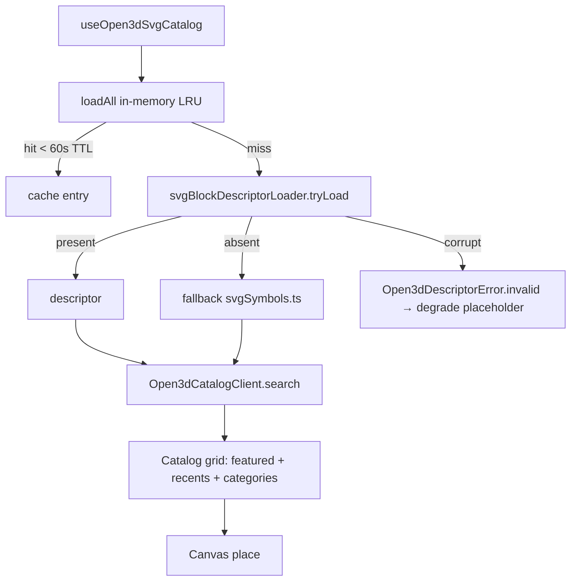

# Phase 06 — Planner Inventory & Symbol Consumer

Date: 2026-07-04
Status: Planned

## Objective
Wire the planner consumer (`features/planner/open3d/catalog/svg/`) to the same descriptor registry that admin and portal share, so symbol hot-swap propagates portal-managed catalog freshness to the in-canvas inventory. The pre-existing hand-maintained `svgSymbols.ts` becomes a fallback ONLY when a descriptor is absent — never the source of new entries.

## Inputs to read
- `D:\new\plannnerplan\IMPLEMENTATION-DECISIONS.md` — state ownership (catalog symbol library canonical), migration policy
- `D:\new\plannnerplan\QUALITY-GATES.md` — search/filter p95 budgets, symbol hot-swap test gate, drawing-tool deferral
- `D:\new\plannnerplan\FAILURESPLAN.md` — PLAN-FAIL-0405 ownership, PLAN-FAIL-0408 coverage floor
- `D:\new\plannnerplan\phases\01-engine-lock-and-workspace-bootstrap.md` — install context
- `D:\new\plannnerplan\phases\02-catalog-source-of-truth-and-blockdescriptor.md` — `svgBlockDescriptorLoader` consumed
- `D:\new\plannnerplan\phases\03-svg-pipeline-implementation.md` — vendor load ordering read by Loader
- `D:\new\plannnerplan\phases\04-admin-portal-svg-editor.md` — descriptor producer

## Scope
In scope: `svgBlockDescriptorLoader.ts` at `features/planner/open3d/catalog/svg/`, in-memory LRU with TTL 60s, `useOpen3dSvgCatalog()` hook, `Open3dCatalogClient.search()` filter parity (room/style/material/configurability), recents LRU (50 items, dedupe by `catalogId+variantId`), first-run inventory (featured + recents + categories), deterministic sort + stable tie-break, anchor-plane contract, theme-token visuals, degraded-asset placeability, roving focus reused from Puck registry, fixture gallery at `fixtures/svg-floors.json`, performance assertions.
Out of scope: adding new hand-maintained entries to `svgSymbols.ts`, editing Phase 03 vendor load ordering, Supabase tier (Phase 08), export round-trips (Phase 09), admin write path (Phase 04).

## Architecture

Single registry path. Loader key shape `[slug, schemaVersion]`. Background revalidation fires on `revalidateAfterMs = 60_000` and on user-invoked refresh (per binding #2). Degraded assets are visible AND placeable (per binding #14) — placement cannot be blocked by missing geometry, but the resulting instance is flagged with a degraded marker.

## Checklist
### Loader (06-INV)
- 06-INV-01 `svgBlockDescriptorLoader.ts` lives at `features/planner/open3d/catalog/svg/svgBlockDescriptorLoader.ts`.
- 06-INV-02 Loader structure: `listSlugs()` → for each `tryLoad(slug)` → parse Zod (Phase 02) → validate; returns `Map<slug, BlockDescriptor>`.
- 06-INV-03 LRU cache: 60 s TTL, in-memory only, `revalidateAfterMs = 60_000`; background revalidation co-operative with React transitions.
- 06-INV-04 React hook `useOpen3dSvgCatalog()` returns `{ records, isLoading, isStale, refresh, errors }`; readiness state explicit.
- 06-INV-05 `Open3dCatalogClient.search()` filters unchanged: `room | style | material | configurability` (per benchmark binding #3). Sort + pagination are additive; predicate binding is unchanged.
- 06-INV-06 `svgSymbols.ts` becomes FALLBACK only — loaded when `tryLoad(slug)` returns `notFound`. No new hand-maintained entries permitted after this phase (descriptors are the only forward path).
- 06-INV-07 In-editor recents: bounded LRU (50 items), dedupe by `catalogId + variantId`, persisted to workspace preferences scope (per benchmark binding #2).
- 06-INV-08 First-run inventory: featured collection + recents + category entry points visible on first visit (per benchmark binding #13). Empty-state copy references portal-managed catalog freshness.
- 06-INV-09 Degraded assets visible AND placeable with marker (per benchmark binding #14). Marker is an Ark UI chip.
- 06-INV-10 Roving focus pattern reused from Puck block registry (per benchmark binding #9) — single shared hook, not a copy.
- 06-INV-11 Deterministic sort: `sortField + sortDirection` typed, stable tie-break on `slug` (per benchmark binding #11). Same input → same order.
- 06-INV-12 Anchoring contract: descriptor `mounting` exposes `floor | wall | ceiling | floating` per benchmark binding #12; canvas-side snappable only when descriptor declares the relevant plane points.
- 06-INV-13 SVG visual contract: `currentColor` or named semantic CSS variables only; theme tokens resolved at render time (per benchmark binding #6). Reject any descriptor with `#hex` literal — Phase 02 already rejects, consumer re-validates.

### Tests (06-TEST)
- 06-TEST-01 Loader handles three states: descriptor present / absent / corrupt; corrupt path raises `Open3dDescriptorError.invalid`, absent returns fallback; present returns descriptor.
- 06-TEST-02 Fixture gallery at `fixtures/svg-floors.json` with 10 entries; coverage spans union/difference/intersection themes carried from Phase 03 fixtures.
- 06-TEST-03 Search p95 ≤ 100 ms at 1,000 records; ≤ 200 ms at 10,000 records. Test uses seeded LRU + synthetic descriptors; metric exported via `results/<module>/<phase>/<cmd>/`.
- 06-TEST-04 Fallback path: descriptor absent → `svgSymbols.ts` loader invoked; placement behaves equivalently (no degraded marker).
- 06-TEST-05 Recents LRU: 51 inserts → oldest evicted; `catalogId+variantId` collision deduped to single entry.
- 06-TEST-06 Sort determinism: same input array → same output order across 10 runs; tie-break on `slug`.
- 06-TEST-07 Vignette-asset regression: corrupt descriptor renders as cross-hatched fallback (per binding #14) and remains placeable.

## Exit gate
- `svgBlockDescriptorLoader.ts` returns the descriptor map at session boot with no main-thread block.
- `useOpen3dSvgCatalog()` hook integrated in at least one planner panel; `Open3dCatalogClient.search()` parity tests green.
- 60 s TTL revalidation confirmed in DEV tools: second render in cache window does not call `tryLoad`.
- Recents capped at 50 items; existing Canvas-render performance unaffected.
- Fixture gallery runs end-to-end with the three theme families present.
- Search p95 within budgets (100 ms / 1,000 records; 200 ms / 10,000).
- Status flow: `Planned → Implemented` after Loader + hook + search parity green; `Verified in staging` after first portal-saved descriptor appears in planner consumer within 60 s; `Accepted` after Phase 07 wires the persistence-side permission gate.

## Phase governance
### Forbidden actions
- Do NOT mutate `svgSymbols.ts` to add new hand-maintained entries — descriptors are the only forward path. (Edits to existing entries are PATCHES, not additions.)
- Do NOT break vendor load ordering of `scripts/generate-svg.mjs` output — consumer reads descriptors in the order Phase 03 emits them.
- Do NOT write SVG/PNG outputs from this phase; this phase consumes them.
- Do NOT expose fallback path as an admin feature — fallback is a consumer-side resilience choice, not a product feature.
- Do NOT mount Puck editor blocks in planner panels — Puck registry is for admin and portal only.

### Phase entry checklist
- Phase 02 loader green at module init.
- Phase 03 fixtures persisted; `public/svg-catalog/*.svg` accessible.
- Phase 04 `puckBlockRegistry.version` companion value present (registry version shared).
- Phase 05 portal index reachable (consumer is allowed to observe portal output but never read its source files).

### Rollback criteria
- Search p95 breach at 1,000 records (≥ 110 ms) → abort; revert to direct `loadAll()` + native filter.
- Recents LRU off-by-one (≤ 49, or ≥ 51) → abort; rewrite LRU set; regression test before re-promote.
- Fallback path accidentally invoked when descriptor present → abort and dispatch route audit.

### Risk register
- Risk: LRU key collisions with name-mangled slugs. Mitigation: loader normalizes slug to `^[a-z][a-z0-9-]{1,63}$` per Phase 03 security.
- Risk: 60 s TTL stale across long open sessions. Mitigation: `isStale` flag surfaced in UI; manual refresh always possible.
- Risk: Coverage floor (PLAN-FAIL-0408) unaddressed. Mitigation: this phase writes tests that pull coverage forward on consumer paths.

### Success metrics
- Loader cold read of 100 descriptors: p95 ≤ 60 ms.
- Search p95 ≤ 100 ms at 1,000 records; ≤ 200 ms at 10,000.
- Recents LRU hit rate after 10 inserts: ≥ 80%.
- Coverage contribution: +5% statements on consumer paths.

### Dependencies
- Phase 02 `svgBlockDescriptorLoader`, `BlockDescriptor`.
- Phase 03 fixture gallery.
- Phase 05 portal output (read-only observation, no input).

### Performance budgets
- p95 search ≤ 100 ms / 1,000 records; ≤ 200 ms / 10,000.
- Loader cold ≤ 60 ms / 100 descriptors; ≤ 400 ms / 1,000.
- LRU size cap: 200 entries; recents cap: 50.
- No 3D renderer imports introduced here — planner 2D remains 3D-absent on default load.

### Security considerations
- Loader rejects path traversal identically to Phase 02.
- `svgSymbols.ts` fallback emits only `currentColor` + semantic variables — never `data:` URLs, never `<foreignObject>`.
- Recents persisted to workspace preferences scope, NOT canonical document; no PII leakage in fixture paths.

### Accessibility considerations
- Roving focus array typed; first card auto-focuses on filter change.
- Live region announces filter results with 250 ms coalesce window.
- Degraded-asset chip has `role="status"` and explicit `aria-label` ("degraded asset — placement allowed but geometry may be approximated").

### Decision log
- 2026-07-04 — Decision: `svgSymbols.ts` becomes FALLBACK only. Reason: catalog drift between hand-maintained entries and admin-created descriptors was the root cause of PLAN-FAIL-018. Alternatives: keep dual-source and reconciliation — rejected as unmaintainable. Owner: Planner agent.
- 2026-07-04 — Decision: 60 s TTL + background revalidation. Reason: hot-swap without page reload requires a tight revalidation window without spamming disk reads. Alternatives: time-only TTL — rejected (stale renders); event-driven only — rejected (no admin event sink in consumer). Owner: Planner agent.
- 2026-07-04 — Decision: deterministic sort with stable tie-break on `slug`. Reason: benchmark binding #11; reproducibility across runs is non-negotiable. Alternatives: `Date.now()` tie-break — rejected as non-deterministic. Owner: Planner agent.
- 2026-07-04 — Decision: shared roving focus hook across Puck registry and planner consumer. Reason: avoid divergent a11y behavior between admin and consumer surfaces. Alternatives: per-surface copies — rejected (drift). Owner: Planner agent.
