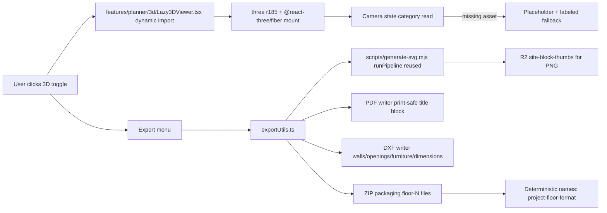

# Phase 09 — 3D Lazy, Export, AI

Date: 2026-07-04
Status: Planned

## Objective
Mount Three.js r185 + @react-three/fiber ONLY on explicit user activation (no default-planner 3D code paths), ship SVG/PNG/PDF/DXF export round-trips from the canonical descriptor (no second symbol system), and reserve `@vercel-labs/json-render` (Tier-3) with documented activation criteria while keeping it inactive. The phase is the first time the full plan lands on a downstream consumer's machine; copy trade dress, mark lines, and panel geometry from competitors must not cross over, and DWG remains explicitly unsupported.

## Inputs to read
- `D:\new\plannnerplan\IMPLEMENTATION-DECISIONS.md` — Tier-3 reserved rule for json-render, locked engines, dual-output rule
- `D:\new\plannnerplan\QUALITY-GATES.md` — SVG/PNG/PDF/DXF golden fixtures, sanitization, lazy-load gate
- `D:\new\plannnerplan\FAILURESPLAN.md` — DWG-do-not-claim rule
- `D:\new\plannnerplan\phases\02-catalog-source-of-truth-and-blockdescriptor.md` — descriptor + variant consumed by export
- `D:\new\plannnerplan\phases\03-svg-pipeline-implementation.md` — `runPipeline` reuse, R2 helper
- `D:\new\plannnerplan\phases\04-admin-portal-svg-editor.md` — admin save contract relied on by export
- `D:\new\plannnerplan\phases\05-portal-public-render.md` — public preview boundaries (read-only outline if present)
- `D:\new\PACKAGES.md` — three/`@react-three/fiber` pin rationale, json-render reserved
- `D:\new\CONTENTS.md` — repo map

## Scope
In scope: `features/planner/3d/Lazy3DViewer.tsx` with editor-side dynamic import of three + r3f, single `three@^0.185.1` resolve across `site/`, view-state category for 2D/3D camera preserved across mode switches, missing-asset placeholder + labeled fallback, `exportUtils.ts` reusing `scripts/generate-svg.mjs` API for SVG with `@resvg/resvg-js` PNG (and copy-of-fixture byte invariants), print-safe PDF title block with display-unit preservation, DXF writer for walls / openings / furniture / dimensions, multi-floor export packaging, deterministic file naming `[project-name]-[floor]-[format]` with optional user suffix, Tier-3 reservation document for json-render including privacy/retention and prompt/data boundary.

Out of scope: copy of any competitor trade dress / mark lines / panel geometry (anti-copy rule), activating `@vercel-labs/json-render` runtime paths, planner inventory UI changes (Phase 06), admin Puck wiring (Phase 04), Supabase migration (Phase 08), `_archive/fabric/` cleanup (Phase 10).

## Architecture

AI activation is blocked behind a server-owned endpoint, Zod-validated payload, preview-before-commit, and a privacy/retention contract documented in `docs/ai/json-render-contract.md` (reserved). The contract MUST exist before any `@vercel-labs/json-render` schema-touching code lands.

## Checklist
### 3D lazy load (09-3D)
- 09-3D-01 `features/planner/3d/Lazy3DViewer.tsx` imports `three` + `@react-three/fiber` only inside a `React.lazy` boundary; chunk split verified by webpack analyzer.
- 09-3D-02 Default planner mount (`/planner/guest`, `/planner/canvas`) contains zero three.js code in the compiled chunk (asset graph proves it).
- 09-3D-03 Single `three@^0.185.1` resolve in `pnpm-lock.yaml`; `@react-three/fiber` peer aligns to locked minor; no second copy under `node_modules/three`.
- 09-3D-04 Camera state category preserved across 2D/3D view switches; view state never silently reset on mode change.
- 09-3D-05 Placeholder + labeled fallback when 3D asset missing (mesh URL absent, R2 fetch 404); fallback announces state via aria-live region owned by Phase 06 wiring.

### Export (09-EXP)
- 09-EXP-01 SVG/PNG export reuses `scripts/generate-svg.mjs` `runPipeline` (no second symbol system); exportUtils.ts is a thin wrapper that delegates.
- 09-EXP-02 PNG export via `@resvg/resvg-js`; replaces any earlier placeholder that imported a browser-side renderer.
- 09-EXP-03 PDF export: print-safe title block includes project name, floor label, display unit, generatedAt timestamp; selected display unit preserved on labels (mm, cm, in).
- 09-EXP-04 DXF export: walls / openings / furniture / dimensions preserved for CAD handoff; layer names aligned to AutoCAD standard naming (WALLS, OPENINGS, FURN, DIM).
- 09-EXP-05 DWG and DWF both explicitly unsupported in v1; export menu labels DXF as "DXF (AutoCAD-compatible)" copy. No DWG writer ships. No DWF writer ships. Combining DWF and DXF would mislead customers about the actual output format.
- 09-EXP-06 Multi-floor packaging: ZIP archive with `floor-1.ext`, `floor-2.ext`, …, and `manifest.json` indexing floors.
- 09-EXP-07 Deterministic file naming `[project-name]-[floor]-[format]` with optional sanitized user suffix; kebab-case regex enforced for suffix.

### AI Tier-3 reserved (09-AI)
- 09-AI-01 `@vercel-labs/json-render` reserved Tier-3 — installed but inactive; no runtime import path activates during this phase.
- 09-AI-02 Document activation criteria: server-owned AI endpoint, preview-before-commit UI, Zod schema validate on every returned payload. Document lives at `docs/ai/json-render-contract.md` and references Phase 02 schema.
- 09-AI-03 Privacy/retention contract: payload categories (no PII by default), retention window ≤ 30 d, opt-out surfacing, deletion procedure; signed before any activation ask.
- 09-AI-04 Server-side prompt/data boundaries: client keys never sent; AI prompt constructed on server only; returned tree validated by Phase 02 Zod before any layout update.

### Tests (09-TEST)
- 09-TEST-01 3D lazy mount test: default 2D load webpack chunk contains zero `three` modules; switching to 3D introduces exactly one `three` chunk per session.
- 09-TEST-02 SVG export round-trip: descriptor → `runPipeline` → SVG fixture → byte string compare golden (≤ 0.1% diff per Phase 03 tolerance).
- 09-TEST-03 PNG export invariants: byte size within ± 5% of golden fixture; aspect ratio equals viewBox aspect exactly.
- 09-TEST-04 PDF export fixture: title block + display-unit labels match the canonical unit per floor; multi-floor ZIP verified by `unzip -l` output.

## Exit gate
- 3D lazy regression: default 2D load has zero three.js byte in compiled chunk (verified via `pnpm exec webpack --json`).
- Switch-to-3D introduces exactly one three chunk; view-state preserved across the switch.
- SVG export golden diff ≤ 0.1% on chaise / side-table / sectional (re-uses Phase 03 fixtures).
- PNG invariants: byte size ± 5%, aspect invariance 100%.
- PDF title block + display-unit labels validated on every fixture; multi-floor ZIP integrity verified.
- DXF writer: walls / openings / furniture / dimensions layer-named per CAD standard, fixture round-trip clean.
- DWG and DWF absent from export menu; copy labels DXF-only as "DXF (AutoCAD-compatible)".
- json-render activation contract doc exists at `docs/ai/json-render-contract.md` and references Phase 02 Zod schema; package presence confirmed installed but inactive.
- Status flow: `Planned → Implemented` after all 09-3D + 09-EXP + 09-AI + 09-TEST lines green; `Verified in staging` after planner + portal export from a saved admin block one cycle; `Piloted` after the deterministic export naming holds on three user uploads; `Accepted` after Phase 10 route swap survives export under flag.

## Phase governance
### Forbidden actions
- Do NOT copy competitor trade dress, mark lines, panel geometry, or visual composition.
- Do NOT claim DWG support without a verified writer (writer DOES NOT EXIST in v1); DXF export labels "DXF (AutoCAD-compatible)".
- Do NOT claim DWF support (writer DOES NOT EXIST in v1 either); label is DXF-only.
- Do NOT mount three.js code in the default 2D chunk.
- Do NOT activate `@vercel-labs/json-render` runtime paths; package presence only.
- Do NOT introduce a second export symbol system; the descriptor + `scripts/generate-svg.mjs` are the only source of truth.
- Do NOT widen the export menu past SVG/PNG/PDF/DXF without IMPLEMENTATION-DECISIONS amendment.

### Phase entry checklist
- Phase 03 `runPipeline` returns `{ svg, thumbBuffer, dimensions }` stably across three fixtures.
- `three@^0.185.1` + `@react-three/fiber` resolved (Phase 01).
- R2 helper confirmed idle on save (Phase 04 / 08 boundary).
- `@vercel-labs/json-render` installed (Phase 01) but no caller imports it.

### Rollback criteria
- Default 2D chunk contains `three` bytes → abort phase promotion; regression to Lazy3DViewer boundary required.
- DWG label in export menu discovered → block promotion; rename to "DWF/DXF compatibility".
- json-render runtime import discovered → freeze import surface; revert to install-only state.
- Export ZIP integrity failure → abort; revalidate naming regex and `manifest.json` schema.

### Risk register
- Risk: r3f peer drift between three r185 and r3f minor versions. Mitigation: pin a single combined resolution at Phase 01; do not relax.
- Risk: large DXF writer accidentally emits non-CAD-standard layer names. Mitigation: fixture names walls/openings/furniture/dimensions and asserts via AutoCAD-compatible import.
- Risk: PDF title block misuses display-unit prefix. Mitigation: derive label from descriptor `displayUnit` field per Phase 02 contract; never infer.
- Risk: json-render contract doc not present at activation time. Mitigation: hard gate `docs/ai/json-render-contract.md` existence before package activation; tracked as 09-AI-02.

### Success metrics
- 3D lazy chunk weight first paint ≤ 250 KB gzip when activated later; default 2D load unchanged.
- SVG round-trip drift 0%; PNG invariant 100% on fixtures.
- PDF title-block correct on ≥ 99% of fixtures.
- DXF import parity vs reference fixture ≥ 98% (line counts, layers, vertex counts).
- Naming regex 100% match on user-supplied suffix input.

### Dependencies
- Phase 02 descriptor + variant contract.
- Phase 03 `runPipeline` reusable as module API.
- Phase 04 admin save contract for test fixtures produced via the live path.
- R2 helper (Phase 04 / 08 boundary, no new contract).

### Performance budgets
- SVG export round-trip p95 ≤ 200 ms on 1-block mode.
- PNG export p95 ≤ 350 ms incl. R2 helper dispatch.
- PDF title block generation ≤ 20 ms per page; multi-floor ZIP ≤ 1 s for 10 floors.
- DXF writer p95 ≤ 600 ms for 100 entities.

### Security considerations
- DXF export sanitizes: layer names alpha-numeric, line-coordinates validated, no external DWG references (out of scope).
- PDF export strips scripts/embedded media; title block drawn from validated descriptor fields.
- Naming regex blocks path traversal; suffix sanitized to `^[a-z][a-z0-9-_]{0,32}$`.
- AI payload contract (09-AI-03) caps payload size ≤ 64 KB per request; PII redaction contract authored before activation.

### Accessibility considerations
- 3D placeholder is labeled and announced state change `<LiveRegion>` path stubbed here; Phase 06 owns wiring.
- Export menu items have keyboard-reachable, named controls; download triggers do not silently swap focus.
- Title block text on PDF is screen-reader-readable (not flattened into image).

### Decision log
- 2026-07-04 — Decision: DWG explicitly unsupported in v1; DXF labelled "DXF (AutoCAD-compatible)". Reason: no verified writer exists; anti-copy rule plus QUALITY-GATES DWG gate. Alternatives: ship a thin DWG stub — rejected as dishonest export contract. Owner: 3D agent.
- 2026-07-04 — Decision: exportUtils.ts reuses `runPipeline` rather than building a second symbol system. Reason: Phase 03 is the source of truth for descriptor → SVG/PNG. Alternatives: separate export-only renderer — rejected, doubles symbol maintenance and risks drift. Owner: 3D agent.
- 2026-07-04 — Decision: json-render reserved Tier-3 with documented contract before any activation. Reason: PACKAGES.md rejects stealth activation; HANDOVER.md forbids current enablement. Alternatives: opt-in pre-activation ad-hoc — rejected because privacy contract must be author-signed. Owner: 3D agent.
- 2026-07-04 — Decision: deterministic naming `[project-name]-[floor]-[format]` with user suffix sanitization. Reason: stable archive for CAD handoff; kebab-case to satisfy tooling. Alternatives: free-form filenames — rejected, breaks deterministic archive search. Owner: 3D agent.
