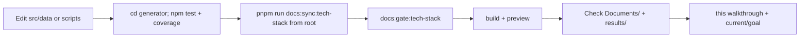

# Generator Maintenance — Walkthrough

**Scope:** Maintenance of site/tech-stack-generator itself: scripts/, data/, tests/, build to Documents/, coverage, sync commands. This package + renderer.

**References:** 
- `site/tech-stack-generator/README.md`
- `site/tech-stack-generator/Readme_Techstack.md`
- `site/tech-stack-generator/CONTENTS.md`
- `site/tech-stack-generator/COVERAGE-REPORT.md`
- Root `START.md` (dev:tech-stack, test:tech-stack, docs:sync:tech-stack, docs:gate:tech-stack)
- `site/tech-stack-generator/scripts/*.mjs`
- GS: evidence, anti-copy in docs

## Steps

1. Edit source data in `src/data/` or scripts.
2. Update tests in `tests/`.
3. Run package typecheck/test.
4. `pnpm run docs:sync:tech-stack` from root (never hand edit generated).
5. Gate: docs:gate:tech-stack.
6. Update this site-workflows/generator-maintenance/ if process changes.

## Commands

```powershell
cd site/tech-stack-generator
npm.cmd run typecheck
npm.cmd run test
npm.cmd run test:coverage
# from repo root for sync
pnpm run docs:sync:tech-stack
pnpm run docs:gate:tech-stack
pnpm run docs:check:tech-stack
pnpm run build:tech-stack
```

## Workflow Diagram



## Plan for Images/Screenshots

- Generator UI screenshots (search, diagrams, tables): `results/site/generator-maintenance/screenshots/`
- Coverage reports, mermaid renders.
- Plan: capture dev server at localhost:5173 vs built preview.
- Store artifacts + reference in COVERAGE-REPORT updates.
