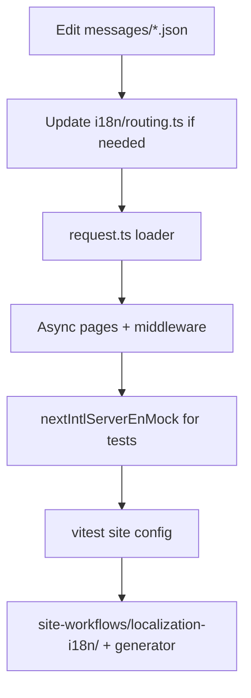

# Localization / i18n — Walkthrough

**Scope:** next-intl setup, messages/, routing, async page handling. `site/i18n/`, proxy middleware, message JSONs.

**References:** 
- `site/i18n/CONTENTS.md`
- `docs/Lockedfiles/site/current.md`
- `site/i18n/routing.ts`, `config.ts`, `request.ts`
- `TESTING.md` (nextIntlServerEnMock)
- `Readme.md`
- GS: evidence + refer docs

## Steps

1. Add/edit keys in `site/i18n/messages/<locale>.json`.
2. Update routing/config if new locale.
3. Ensure server components use async request locale.
4. Add/update mocks for tests.
5. Run typecheck + i18n-specific tests.
6. Regenerate docs.

## Commands

```powershell
# root
pnpm --filter oando-site run typecheck
cd site
pnpm exec vitest run tests/ --config vitest.site.config.ts -t "i18n|intl|locale|messages"
pnpm run docs:sync:tech-stack
```

## Workflow Diagram



## Plan for Images/Screenshots

- Localized pages (if visual diff): `results/site/localization-i18n/screenshots/`
- Focus on nav/footer locale switch (note: prefix never).
- Document any RTL or long-string layout impact.
- Plan: add to tech-stack screenshots section.
