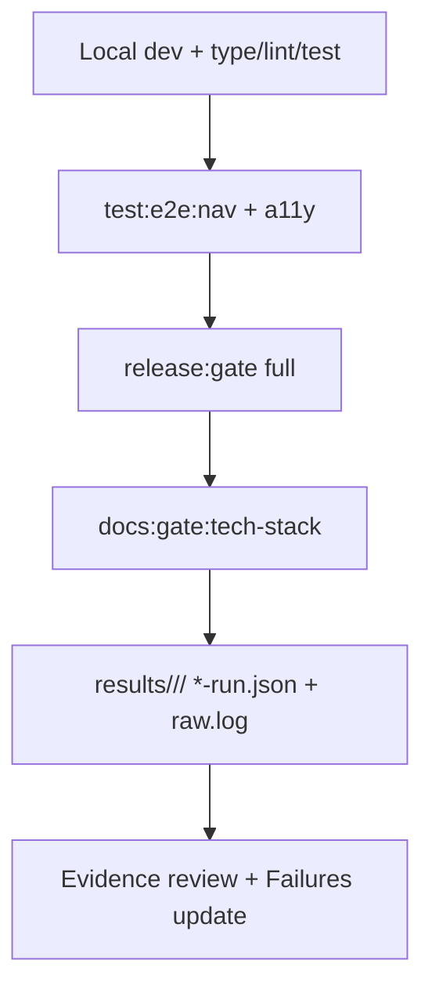

# Release QA Site — Walkthrough

**Scope:** Site release gates, CI, a11y, e2e nav, coverage for marketing+site layers. release:gate, site-ui checks.

**References:** 
- `START.md` (release:gate, test:a11y, test:e2e:nav, test:planner-catalog)
- `TESTING.md`
- `testing-handbook.md`
- `Failures.md` (gate policy)
- `docs/Lockedfiles/tests/current.md`
- `site/tests/e2e/README.md`

## Steps

1. Local: typecheck, lint, relevant vitest.
2. Run site e2e + a11y.
3. Full release:gate (read Failures first).
4. Capture all artifacts in results/ (no bypass).
5. Verify tech-stack docs build.
6. Update this workflow.

## Commands

```powershell
# Always read Failures.md first
pnpm run typecheck
pnpm run lint
pnpm --filter oando-site run test:browsers:install   # once
pnpm --filter oando-site run test:a11y
pnpm --filter oando-site run test:e2e:nav
pnpm run release:gate
pnpm run docs:gate:tech-stack
```

## Workflow Diagram



## Plan for Images/Screenshots

- Failing a11y or e2e traces/screenshots go to playwright report (retained per handbook).
- Marketing page captures for visual QA: `results/site/release-qa-site/`
- Include gate summary screenshots if UI involved.
- Always preserve raw + structured.
